# Day01 - CloudServcie AWS(1) - 개요, 주요서비스, EC2

 

## Table of Contents

- [Day01 - CloudServcie AWS(1) - 개요, 주요서비스, EC2](#day01---cloudservcie-aws1---개요-주요서비스-ec2)
  - [Table of Contents](#table-of-contents)
  - [why cloud?](#why-cloud)
  - [클라우드의 개요](#클라우드의-개요)
  - [클라우드 유형](#클라우드-유형)
  - [클라우드 서비스 제품](#클라우드-서비스-제품)
  - [비교하기 요약](#비교하기-요약)
  - [클라우드 서비스 기본 개념](#클라우드-서비스-기본-개념)
    - [Virtualization (가상화)](#virtualization-가상화)
    - [가상 머신(VM)](#가상-머신vm)
    - [하이퍼 바이저](#하이퍼-바이저)
    - [가상화의 유형](#가상화의-유형)
    - [가상화 vs 컨테이너화](#가상화-vs-컨테이너화)
    - [CDN(Content Delivery Network)이란?](#cdncontent-delivery-network이란)
    - [스냅샷](#스냅샷)
    - [Data Center(데이터 센터)](#data-center데이터-센터)
    - [Region(지역)](#region지역)
    - [Availability Zone(가용 영역)](#availability-zone가용-영역)
  - [AWS 주요 서비스](#aws-주요-서비스)
    - [ECS](#ecs)
    - [AMI](#ami)
    - [Security Group](#security-group)
    - [Key Pair](#key-pair)
    - [Elastic IP](#elastic-ip)
  - [주요 서비스](#주요-서비스)
    - [RDS](#rds)
    - [S3](#s3)
    - [Route 53](#route-53)
    - [CloudFront](#cloudfront)
    - [Lambda](#lambda)
    - [Elastic Beanstalk](#elastic-beanstalk)
    - [IAM](#iam)
      - [CloudWatch](#cloudwatch)
    - [VPC](#vpc)
    - [Amazon DocumentDB(MongoDB와 호환)](#amazon-documentdbmongodb와-호환)
    - [Amazon DynamoDB](#amazon-dynamodb)
    - [ELB](#elb)
    - [Code Commit](#code-commit)
    - [CodeBuild](#codebuild)
    - [CodeDeploy](#codedeploy)
    - [[CodePipeline]https://docs.aws.amazon.com/ko_kr/codepipeline/?id=docs_gateway)](#codepipelinehttpsdocsawsamazoncomko_krcodepipelineiddocs_gateway)
  - [AWS 실습 1 - EC2 인스턴스 생성하기](#aws-실습-1---ec2-인스턴스-생성하기)

 

## why cloud?

|             기업 인프라              |
| :----------------------------------: |
| 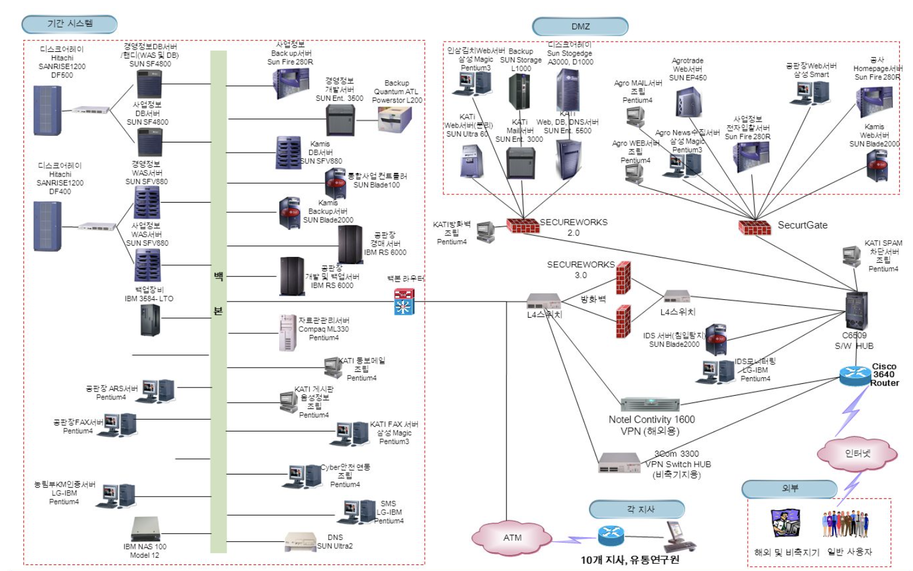 |

> 클라우드 도입이 안되어있을때 시스템 복잡도가 높고
> 물리적인 서버가 너무 많이 사용되고 있다.  
> 비용도 많이들고 관리도 어렵고 많은 리스크와 비용이 들어간다.

 

## 클라우드의 개요

> 클라우드 컴퓨팅 -> 인터넷 기반의 컴퓨팅  
> 인터넷을 통해 사용자에게 제공하는 인프라, 플랫폼 또는 소프트웨어를 의미

- 클라우드 특징
  - On Demand
  - 대규모 확장성
  - 종량제 과금
  - 관리의 편의성

> 클라우드는 컴퓨팅 자원(CPU, 메모리, 디스크)등을 원하는 대로 쓸 수 있고  
> 자세한 내부를 모르더라도 얼마든지 원하는 것을 사용할 수 있다는 것이며  
> `인터넷이 연결된 곳이라면 이것을 보장받을 수 있다는 것이다.`

 

## 클라우드 유형

- Service Model

|             클라우드 유형              |
| :------------------------------------: |
| 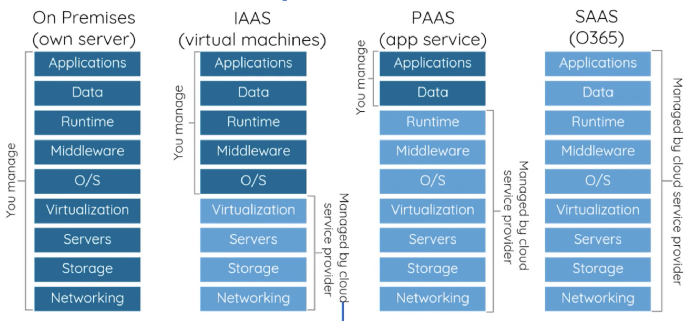 |

- Iaas(Infranstruce as a Service)

> 서버 네트워킹, 스토리지와 데이터 센터 공간 등의  
> 컴퓨팅 자원을 종량제 방식

- PaaS(Platform as a Service)

> 기본 하드웨어, 소프트웨어, 프로비저닝, 호스팅 등을  
> 구매하여 관리하는 비용과 복잡도 없이, 웹 기반 애플리케이션을  
> 빌드하여 제공하는 전과정을 지원하는 클라우드 기반 환경 제공

- IaaS에 Os, Middleware, Runtime 추가
- AWS Elastic Beanstalk, Google App Enging

 

- SaaS(Software as a service)

> 클라우드 기반 애플리케이션 혹은 SaaS는 모든 기능이 동작하는 SW를 제공

 

- deployment Model

- public Cloud

> Cloud 서비스 필요로 하는 사용자 누구든지 사용 가능  
> 누구나 사용한 만큼 비용 지불

- private Cloud

> 기업 및 기관 내부에서만 사용 가능한 Cloud Computing 환경 구축

- Hybird Cloud

> public / private Cloud를 조합해서 사용하는 형태

 

## 클라우드 서비스 제품

- 아마존은 **AWS** (Amazon Web Service) [aws.amazon.com/](https://aws.amazon.com/)

- 마이크로소프트 **애저** (Azure)  [azure.microsoft.com/](https://azure.microsoft.com/)

- 구글 **GCP** (Google Cloud Platform)  [cloud.google.com/](https://cloud.google.com/)

- 오라클 **OCI** (Oracle Cloud Infrastructure)  [www.oracle.com/cloud/](https://www.oracle.com/cloud/)

- IBM 클라우드 (IBM Cloud)  [www.ibm.com/kr-ko/cloud](https://www.ibm.com/kr-ko/cloud)

- 알리바바 클라우드 (Alibaba Cloud)  [www.alibabacloud.com/](https://www.alibabacloud.com/)

- KT 클라우드 (KT Cloud)  [cloud.kt.com/](https://cloud.kt.com/)

- 네이버 **NCP** (Naver Cloud Platform)  [www.ncloud.com/](https://www.ncloud.com/)

 

## [비교하기](https://twodragon.tistory.com/557) 요약

|  AWS vs Azure vs GCP 가격 및 서비스 비교  |
| :---------------------------------------: |
| 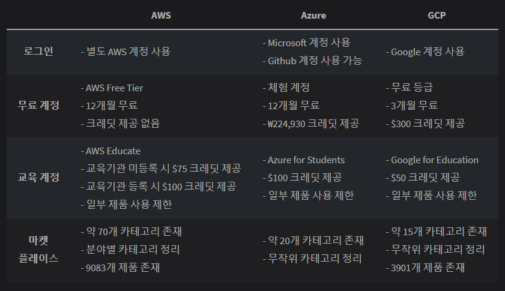 |

 

| 온프라미스 vs AWS vs Azure vs GCP 비교를 통해 각 서비스 이해와 네트워크, 클라우드 구조 파악 |
| :-----------------------------------------------------------------------------------------: |
|                             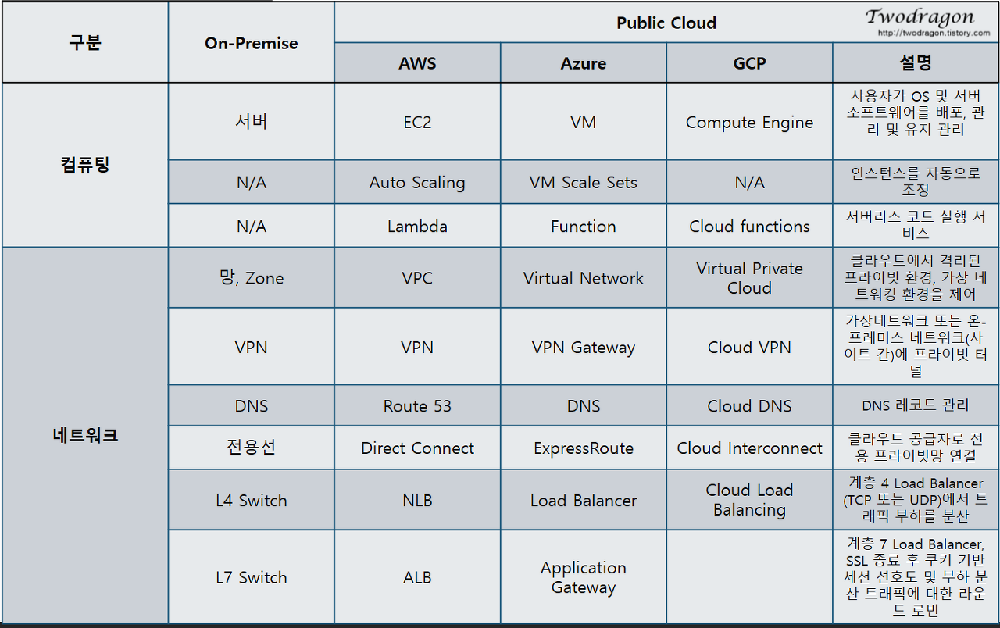                             |
|                    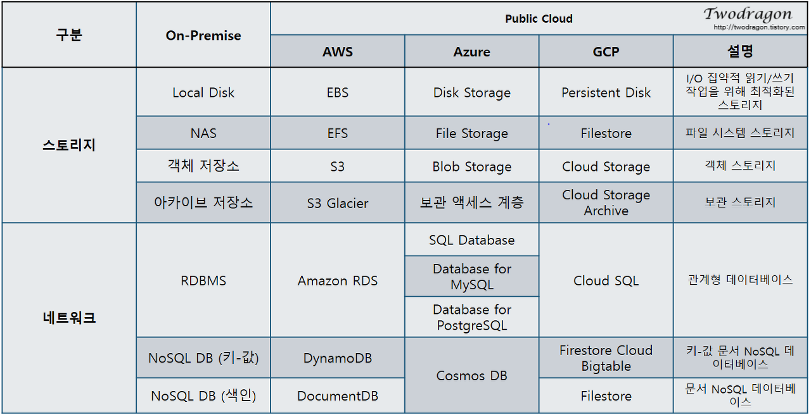                     |
|                            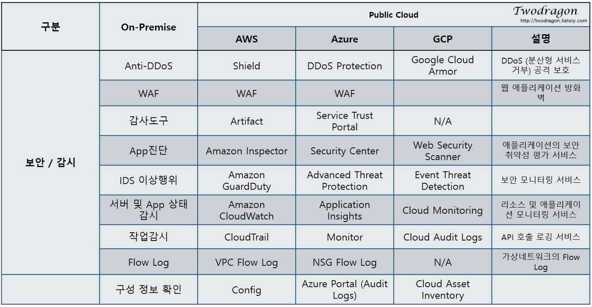                            |
|                      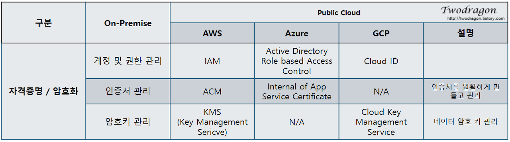                      |

 

## 클라우드 서비스 기본 개념

 

### Virtualization (가상화)

 

> 가상화란 물리적 컴퓨터 하드웨어를 보다 효율적으로 활용할 수 있도록 해주는 프로세스이다.  
> 이는 클라우드 컴퓨팅의 기반을 제공해준다.

 

- 리소스 효율성
- 관리 편의성
- 가동 중단 시간 최소화
- 프로비저닝 고속화

 

### 가상 머신(VM)

 

> 가상 머신은 소프트웨어 형식으로 물리적 컴퓨팅을 시뮬레이션하는 가상 환경이다.  
> 이들은 일반적으로 vm의 구성, 가상 하드 드라이브의 스토리지,  
> 그리고 특정 시점에 해당 상태를 유지하는 VM의 일부 스냅샷을 포함한 다수의 파일들로 구성

 

### 하이퍼 바이저

 

> 하이퍼 바이저는 VM을 코디네이션하는 소프트웨어 계층  
> 이는 VM 및 기반 물리적 하드웨어 간의 인터페이스 역할을 수행하며,  
> 각각 실행에 필요한 물리적 리소스에 액세스할 수 있도록 보장한다.  
> 이는 또한 서로간의 메모리 공간이나 컴퓨팅 사이클에서 영향을 줌으로써  
> VM이 서로간에 간섭하지 않도록 보장한다.

 

|                하이퍼 바이저                 |
| :------------------------------------------: |
| 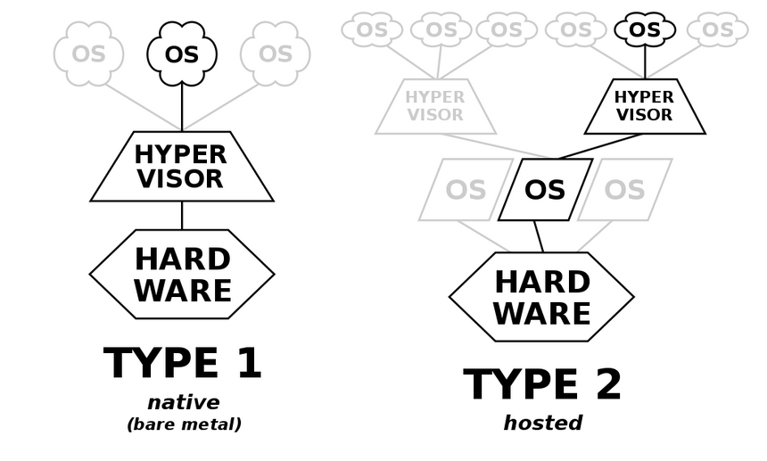 |

- 유형 1 또는 베어메탈 하이퍼 바이저는 기반 물리적 리소스와 상호작용하여 기존의 운영체제를 모두 대체
- 유형 2 하이퍼바이저는 기존 OS에서 애플리케이션으로 실행 된다.

 

### 가상화의 유형

 

- 데스크탑 가상화
- 네트워크 가상화
- 스토리지 가상화
- 데이터 가상화
- 애플리케이션 가상화
- 데이터 센터 가상화
- CPU 가상화
- GPU 가상화
- Linux 가상화
- 클라우드 가상화

 

### 가상화 vs 컨테이너화

 

- 가상화

> 서버 가상화는 하드웨어에서 전체 컴퓨터를 재생성하며, 이는 다시 전체 OS를 실행한다.  
> OS는 하나의 애플리케이션을 실행한다.

 

- 컨테이너

> 컨테이너는 대안적인 접근 방법을 사용하여 애플리케이션 및 해당 애플리케이션이 의존하는  
> 소프트웨어 라이브러리 및 환경 변수 등만을 실행하면서 기반 OS커널을 공유  
> 따라서 컨테이너는 보다 작아지며 배치 속도가 빠름.

 

### CDN(Content Delivery Network)이란?

 

| CDN |
| :-: |

|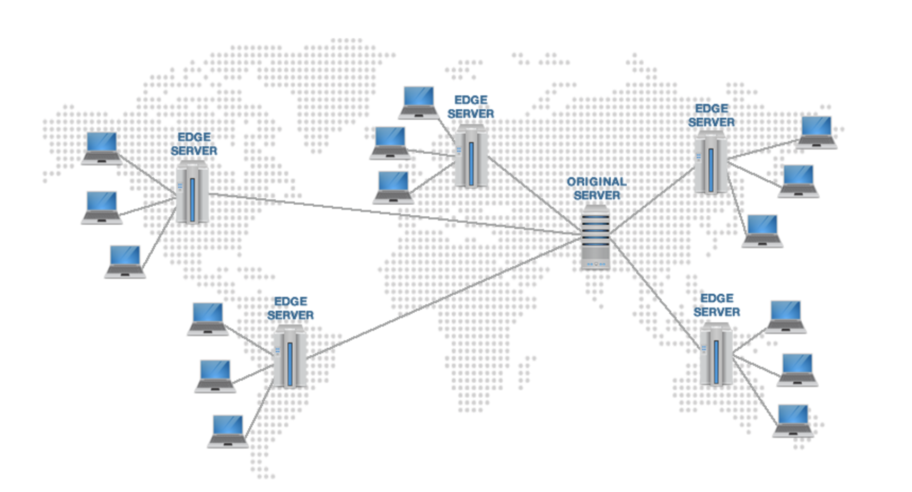|

- CDN은 지리적 제약 없이 전 세계 사용자에게 빠르고 안전하게 컨텐츠를 전송할 수 있는 컨텐츠 전송 기술
- CDN은 서버와 사용자 사이의 물리적인 거리를 줄여 컨텐츠 로딩에 소요되는 시간을 최소화한다.
- CDN은 각 지역에 캐시 서버(PoP, Points of Presence)를 분산 배치해, 근접한 사용자의 요청에 원본 서버가 아닌 캐시서버가 컨텐츠 전달.

 

> 그러면 origin 서버와 edge 서버의 싱크는 어떻게 맞춰야 하는 걸까..?

 

- CDN이 필요한 경우

 

> 인터넷을 통해 비즈니스를 운영하거나 웹 사이트에서 그래픽 이미지, 동영상 파일 등의 컨텐츠를 제공한다면  
> CDN 서비스를 이용할 필요가 있다. CDN은 동영상 스트리밍이나 온라인 게임, 대용량 파일 전송, 그리고 해상도가 높아  
> 용량이 큰 이미지를 다루는 쇼핑몰, 포털 사이트 등에서 안정적인 서비스 제공을 위해 활용되고 있다.

 

### 스냅샷

- 특정 시점에 스토리지의 파일 시스템을 포착해 보관하는 기술
- Windows OS의 복원 지점과 같이 장애나 데이터 손상 시 스냅샷을 생성한 시점으로 데이터를 복구
- 스냅샷은 원본 데이터를 그대로 복사해 다른 곳에 저장하는 백업과 달리 `초기 생성 시 혹은 데이터의 변경이 있기 전까지는 스토리지의 공간을 차지하지 않는다.`
- 메타데이터(데이터에 대한 부가적인 정보)의 복사본에 해당하기 때문에 생성하는 데 오랜 시간이 걸리지 않고, 장애 상황이 발생해도 빠르게 데이터를 복원

 

### Data Center(데이터 센터)

> 수많은 서버들을 한데 모아 네트워크로 연결해놓은 시설

 

- IDC - Internet Data Center
- CDC - Cloud Data Center

 

### Region(지역)

 

- Region 은 Data Center가 위치한 지역
- IT 리소스를 생성할 Region은 선택 가능
- 대상 고객의 지역과 자원 생성할 Region이 최대한 가까워야 함
- 국가마다 자원사용 비용이 다름

 

### Availability Zone(가용 영역)

 

- 하나의 Region 은 두 개 이상의 Availability Zone 으로 구성됨.
- 줄여서 AZ 로 표시

 

## AWS 주요 서비스

 

### [ECS](https://docs.aws.amazon.com/ko_kr/AWSEC2/latest/UserGuide/concepts.html)

- 인스턴스: 가상 컴퓨팅 환경
- Amazon 머신 이미지(AMI): 서버에 필요한 운영체제와 여러 소프트웨어들이 적절히 구성된 상태로 제공되는 템플릿으로 인스턴스를 쉽게 만들 수 있습니다.
- 인스턴스 유형: 인스턴스를 위한 CPU, 메모리, 스토리지, 네트워킹 용량의 여러 가지 구성 제공
- 키 페어를 사용하여 인스턴스 로그인 정보 보호(AWS는 퍼블릭 키를 저장하고 사용자는 개인 키를 안전한 장소에 보관하는 방식)
- 인스턴스 스토어 볼륨: 임시 데이터를 저장하는 스토리지 볼륨으로 인스턴스 중단, 최대 절전 모드로 전환 또는 종료 시 삭제됨
- Amazon Elastic Block Store(Amazon EBS), 즉 Amazon EBS 볼륨을 사용해 영구 스토리지 볼륨에 데이터 저장
- 인스턴스와 Amazon EBS 볼륨 등의 리소스를 다른 물리적 장소에서 액세스할 수 있는 리전 및 가용 영역
- 보안 그룹을 사용해 인스턴스에 연결할 수 있는 프로토콜, 포트, 소스 IP 범위를 지정하는 방화벽 기능
- 탄력적 IP 주소(EIP): 동적 클라우드 컴퓨팅을 위한 고정 IPv4 주소
- 태그: 사용자가 생성하여 Amazon EC2 리소스에 할당할 수 있는 메타데이터
- AWS 클라우드에서는 논리적으로 격리되어 있지만 원할 때마다 고객의 네트워크와 간편히 연결할 수 있는 가상 네트워크인 Virtual Private Clouds(VPC)

 

### AMI

- AMI - Amazon Machine Image
- 가상머신은 Image를 활용하여 생성
- 이미지 - OS, 설치된 프로그램, 설정 등이 포함된 파일
- 이미지를 가상 서버에 적용하여 동일한 환경 구성 가능
- 다양한 AMI 제공 - OS별, 목적별, Market Place

### Security Group

- EC2 인스턴스에 대한 보안 설정
- default 로 EC2는 모든 port 가 막혀있음
- inbound, outbound에 대해 접속 허용 설정 가능

### Key Pair

- EC2 인스턴스에 접속하기 위한 암호화 된 파일
- AWS 처음 사용시 새로운 Key Pair 생성해야 함.
- Mac 환경에서는 pem 사용 가능, 윈도우 환경에서는 ppk 로 변환 필요.

### Elastic IP

- EC2 인스턴스는 Private IP 와 Public IP를 보유
- 기본적으로 할당되는 Public IP는 인스턴스 재실행 후에 변경됨.
- 영구적인 Public IP를 설정하려면 Elastic IP 사용

 

> EC2 서버를 내렸다 올리면 IPv4 public IP가 변경된다.  
> 서버 IP가 변동 되지 않도록 탄력적 IP를 설정해야한다!

 

## 주요 서비스

 

### [RDS](https://docs.aws.amazon.com/ko_kr/AmazonRDS/latest/UserGuide/Welcome.html)

 

> 다양항 DB를 가상화해서 제공하는 서비스  
> DB 인스턴스를 생성할 수 있다.  
> MySQL, MariaDB 등을 지원

 

### [S3](https://docs.aws.amazon.com/ko_kr/AmazonS3/latest/userguide/Welcome.html)

 

> 주로 이미지나 파일을 저장하는 스토리지 영역으로 사용

 

### [Route 53](https://docs.aws.amazon.com/ko_kr/Route53/latest/DeveloperGuide/Welcome.html)

 

> DNS 서비스  
> 특정 서버의 도메인을 등록하거나 연결시킬때 사용

 

### [CloudFront](https://docs.aws.amazon.com/ko_kr/AmazonCloudFront/latest/DeveloperGuide/Introduction.html)

 

> 동적 웹 컨텐츠를 사용자에게 더 빨리 배포할 수 있도록 하는 서비스  
> CDN과 연관!

 

### Lambda

 

[https://docs.aws.amazon.com/ko_kr/lambda/latest/dg/welcome.html](https://docs.aws.amazon.com/ko_kr/lambda/latest/dg/welcome.html)

[https://aws.amazon.com/ko/getting-started/hands-on/run-serverless-code/](https://aws.amazon.com/ko/getting-started/hands-on/run-serverless-code/)

 

> 서버리스?  
> 서버를 프로비저닝 하지 않고 코드를 실행할 수 있는 것

 

### [Elastic Beanstalk](https://docs.aws.amazon.com/ko_kr/elasticbeanstalk/latest/dg/Welcome.html)

 

> EC2를 포괄적으로 감싸는?  
> 자동적으로 유연성을 제공하거나 프로비저닝을 해주는 서비스

 

### [IAM](https://docs.aws.amazon.com/ko_kr/IAM/latest/UserGuide/introduction.html)

 

> AWS 리소스에 대한 액세스를 안전하게 제어할 수 있는 웹서비스  
> IAM을 사용하여 리소스를 사용하고 인증 및 권한 부여 대상을 제어

 

#### [CloudWatch](https://docs.aws.amazon.com/ko_kr/AmazonCloudWatch/latest/monitoring/WhatIsCloudWatch.html)

 

> 응용 프로그램 내에서 리소스 및 애플리케이션에  
> 대해 측정할 수 있는 변수인 지표를 수집하고 추적

 

### [VPC](https://docs.aws.amazon.com/ko_kr/vpc/latest/userguide/what-is-amazon-vpc.html)

 

> 사용자가 정의한 가상 네트워크로 AWS 리소스 시작 가능

 

### [Amazon DocumentDB(MongoDB와 호환)](http://aws.amazon.com/documentdb/)

> 클라우드에서 MongoDB와 호환되는 데이터베이스를 설정, 운영 및 조정하는 데 사용할 수 있는 관리형 데이터베이스 서비스

 
 

### [Amazon DynamoDB](http://aws.amazon.com/dynamodb/)

 

> 완벽하게 관리되는 NoSQL 데이터베이스 서비스로, 원활한 확장성과 함께 빠르고 예측 가능한 성능을 제공

 

### [ELB](https://docs.aws.amazon.com/ko_kr/elasticloadbalancing/latest/userguide/what-is-load-balancing.html?icmpid=docs_elbv2_console#elb-features)

 

> AWS를 사용하면서 자동으로 loadBalancer를 사용할 수 있다.  
> 어떤 서버를 사용할 건 지 동적으로 결정

 

### [Code Commit](https://docs.aws.amazon.com/ko_kr/codecommit/latest/userguide/welcome.html)

 
 

### [CodeBuild](https://docs.aws.amazon.com/ko_kr/codebuild/latest/userguide/welcome.html)

 
 

### [CodeDeploy](https://docs.aws.amazon.com/ko_kr/codedeploy/?id=docs_gateway)

 
 

### [CodePipeline]https://docs.aws.amazon.com/ko_kr/codepipeline/?id=docs_gateway)

 

## AWS 실습 1 - EC2 인스턴스 생성하기

 

|       인스턴스 시작        |
| :------------------------: |
| 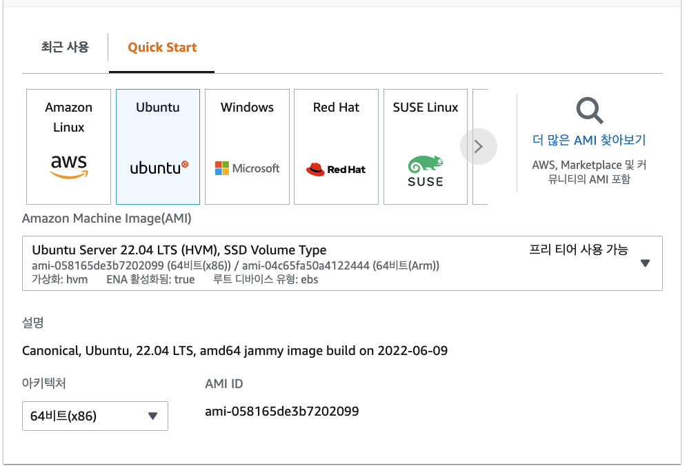 |

> AMI 선택하기 Ubuntu로 선택해보기  
> 연습이니까 프리티어 사용가능한지 확인!

 

|                    인스턴스 유형                    |
| :-------------------------------------------------: |
| 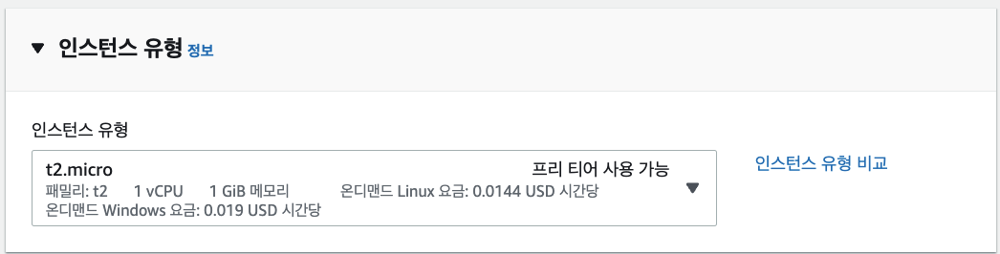 |

> micro 선택  
> 프리티어 사용 가능 확인

 

|              키페어               |
| :-------------------------------: |
|  |

 

> 서버에 로그인 할 키페어를 설정한다.  
> 기존의 키페어가 있어서 새로운 키페어를 안만들어도 되지만  
> 키페어를 만들어야 한다!

 

|                      터미널                      |
| :----------------------------------------------: |
| 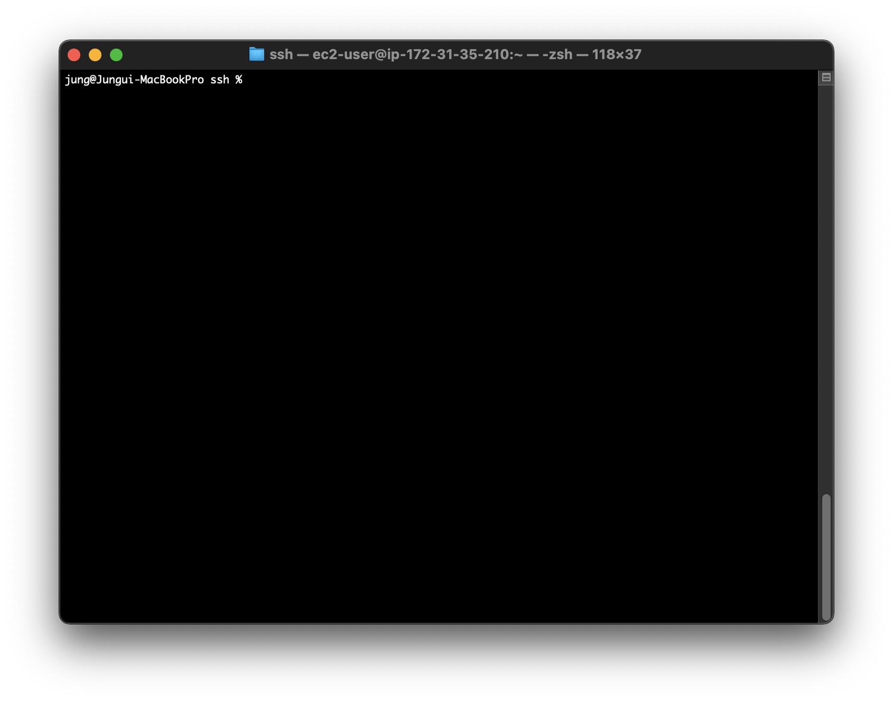 |

 

> 서버에 접속할 터미널 열기.  
> 다운 받았던 키페어를 저장한 디렉토리로 이동

 

|               퍼블릭 ip 주소                |
| :-----------------------------------------: |
|  |

 

- xxx.pem 키페어를 권한 설정을 400으로 변경
  - chmod 400 xxx.pem
- 서버 접속 명령어
  - ssh -i xxx.pem ubuntu@(퍼블릭 IPv4 주소)
  - ec2같은 경우 ec2-user@(퍼블릭 IPv4 주소)

 

> 서버를 중지시키고 다시 실행시키면  
> (퍼블릭 IPv4 주소)가 변경된다.  
> 이때 탄련적 IP를 설정하여 변경되는 것을 막을 수 있다!
