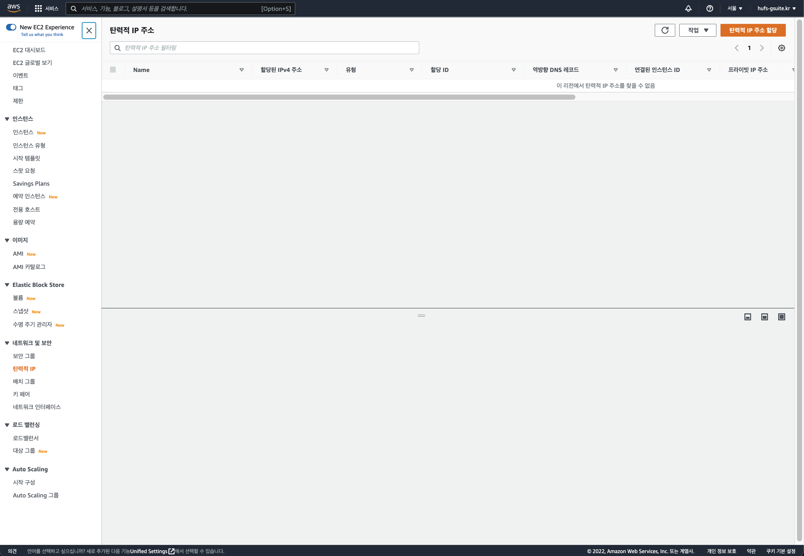
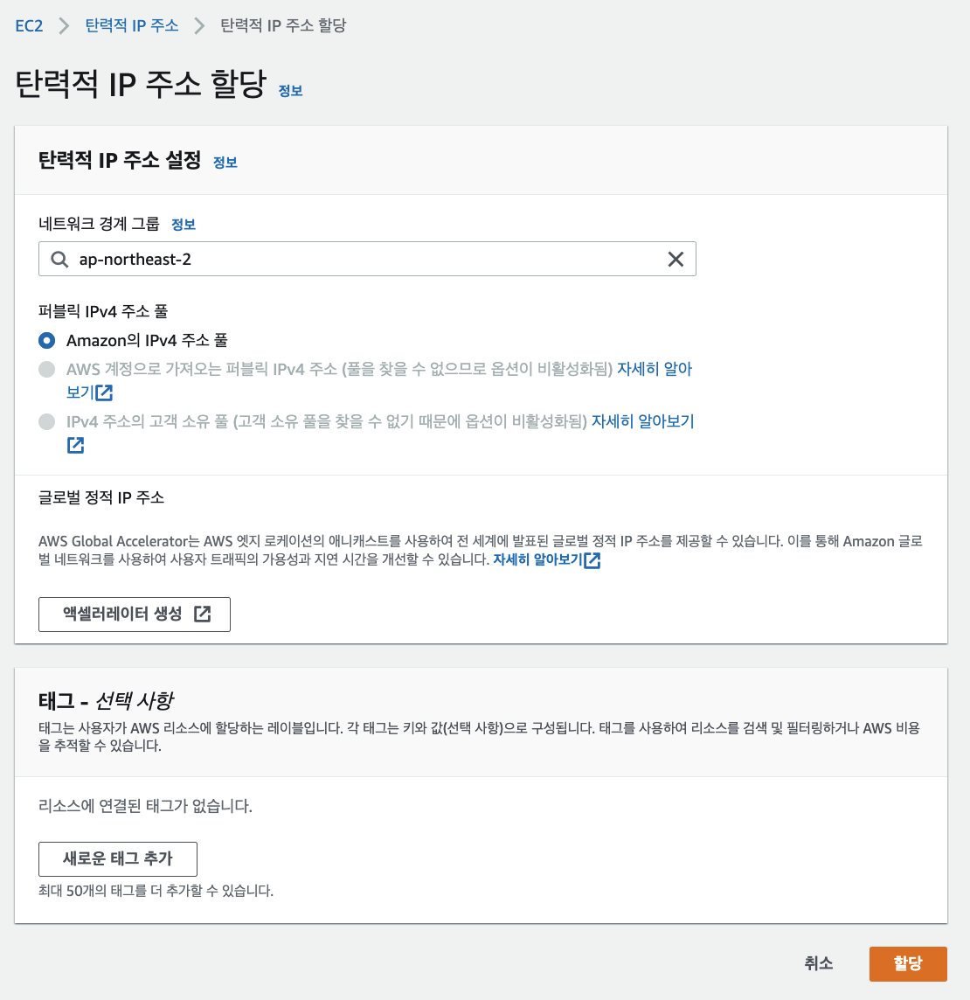
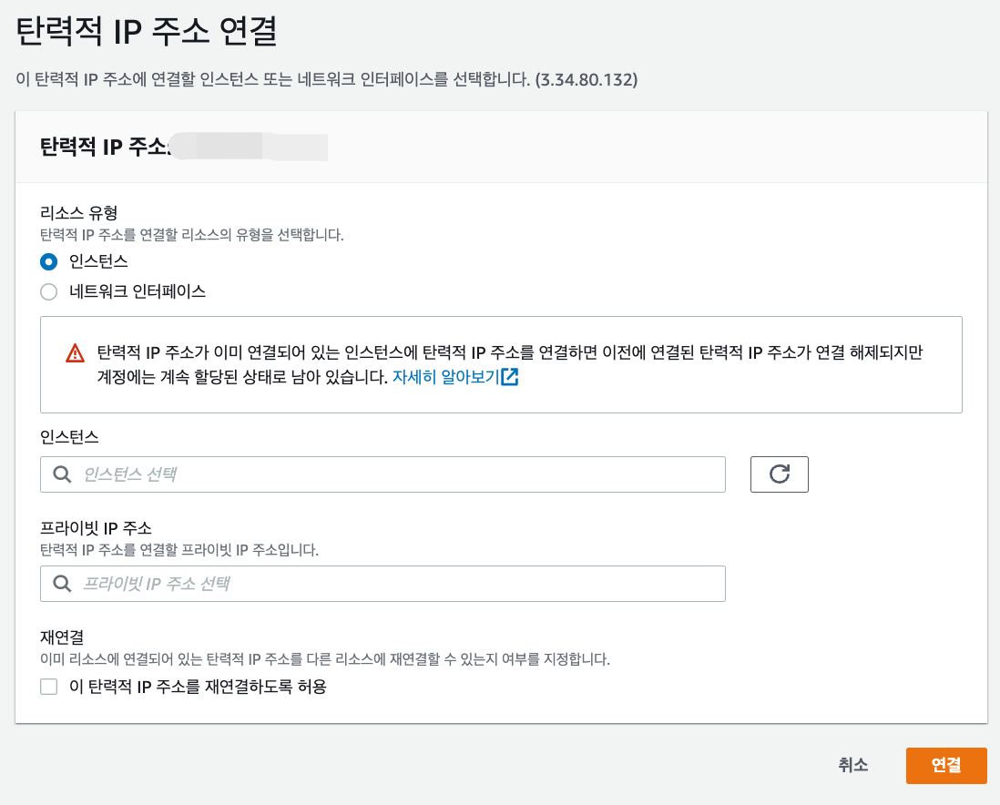
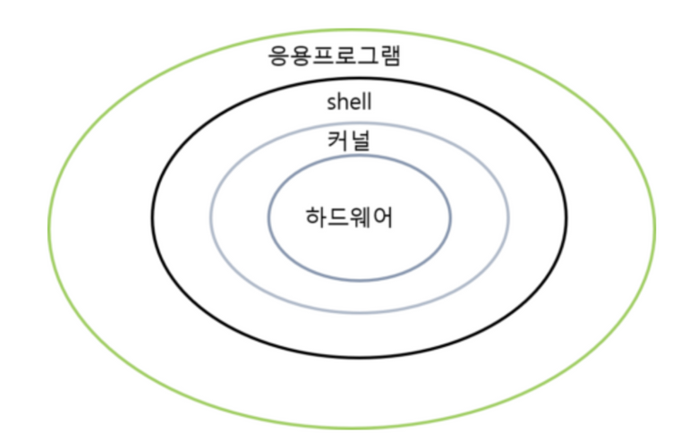
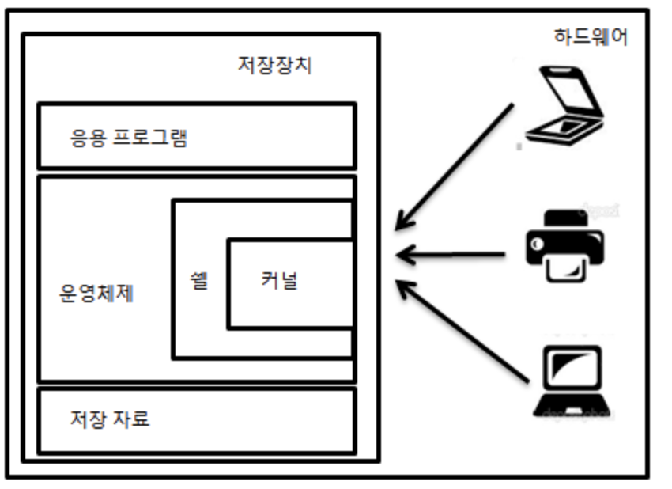
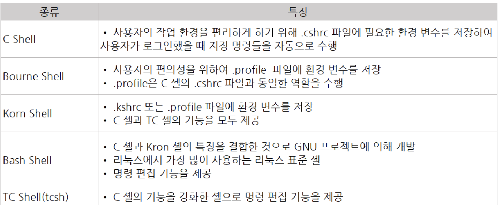

# Day02 - 탄력적 IP 세팅, 리눅스 명령어

## Table of Contents

- [Day02 - 탄력적 IP 세팅, 리눅스 명령어](#day02---탄력적-ip-세팅-리눅스-명령어)
  - [Table of Contents](#table-of-contents)
  - [탄력적 IP 세팅](#탄력적-ip-세팅)
  - [Linux](#linux)
    - [리눅스 파일 시스템 구조](#리눅스-파일-시스템-구조)
    - [리눅스 명령어](#리눅스-명령어)

## 탄력적 IP 세팅

 

> 서버를 내렸다가 다시 올리게 되면 IPv4 퍼블릭 IP 주소가 변경된다.  
> 탄력적 IP세팅을 통해 서버가 중지되고 실행되어도 IP가 변경 되지 않도록 할 수 있다.

 

|                탄력적 IP 설정                |
| :------------------------------------------: |
|  |

 

|              탄력적 IP 주소 할당               |
| :--------------------------------------------: |
|  |

> 그대로 할당을 누르면

 

|                  탄력적 IP 주소 할당 완료                  |
| :--------------------------------------------------------: |
|  |

 

> Ip 주소를 할당받을 수 있다.

 

|                    탄력적 IP 주소 연결                    |
| :-------------------------------------------------------: |
|  |

 

> 그 후 작업을 누르고  
> 탄력적 IP 주소 연결을 클릭

 

|                   탄력적 IP 주소 연결 2                   |
| :-------------------------------------------------------: |
|  |

 

> 그 후 탄력적 IP 주소를 연결할 인스턴스를 지정한 후  
> 연결 클릭

 

## Linux

 

- 오픈소스 운영체제
- GPL
- 다중 사용자 및 다중 처리 시스템
- 유연성과 확장성
- POSIX와 호환

 

|            리눅스의 구성             |
| :----------------------------------: |
|  |

 

- 커널(kernel)
  - 메모리에 상주하면서 시스템을 관리하는 운영체제의 핵심
  - 운영체제 응용프로그램 수행에 필요한 여러 서비스 제공
  - 프로세스, 메모리, 입출력, 파일 관리 등
- 쉘
  - 사용자가 입력한 문장을 읽어 요청을 실행하는 명령어 해석기/번역기
  - 커널과 직접적으로 연결돼 있어 명령어를 해석한 결과를 다른 프로그램 또는 커널로 전송
  - Bourne 셸, C셸, Korn 셸, bash셸 등
  - 리눅스의 표준 셸은 bash 셸이다.
  - zsh

 

|            zsh             |
| :------------------------: |
|  |

 

- 파일 시스템
  - 파일 저장의 기본적인 구조, 시스템 관리를 위한 기본 환경을 제공
  - 계층적인 트리 구조 형태(디렉토리, 서브 디렉터리, 파일 등)
  - 리눅스 표준 파일 시스테믄 ext4

 

|                shell 종류                |
| :--------------------------------------: |
|  |

 

### 리눅스 파일 시스템 구조

 

- 부트 블록

  - 리눅스 파일 시스템 구조는 부트 블록으로 시작 되고 부트블록은 컴퓨터 시스템을 부팅 하기 위한 `부팅에 관련된 이미지를 가짐`
  - 이는 리눅스 운영체제가 시작 되면 제일 처음 읽음으로써 리눅스를 기동하게 된다.
  - 부트 블록이 메모리에 모두 올라가면 리눅스 운영체제는 먼저 init 프로세스를 기동하게 된다.

- 슈퍼 블록(Super Block)

  - 부트블록 다음에 실행되는 블록으로 `파일 시스템의 크기`, `여유 공간(빈 블록 리스트)`, `파일 시스템의 이름`, `디스크 이름` 등의 정보를 가진다.
  - 슈퍼 블록이 가지고 있는 정보
    - 1. 파일 시스템의 크기, 블록 수 등 이용 가능한 블록리스트
    - 2. 빈 블록 리스트에서 그 다음의 빈 블록을 가리키는 인덱스
    - 3. inode 목록의 크기, 파일 시스템에 있는 빈 inode 수와 목록
    - 4. 빈 inode 목록의 크기, 파일 시스템에 있는 빈 inode 수와 목록
    - 5. 빈 블록과 빈 inode 목록들에 대한 lock 필드
    - 6. 슈퍼 블록들이 수정되었는지 나타내는 플래그(flag)
    - 7. 파일 시스템 이름과 파일 시스템 디스크의 이름

- inode

  - 리눅스 커널이 `현재 사용하는 자료구조(파일 정보)를 유지하는 구조체`이다. 리눅스는 파일에 접근 시 inode를 사용해 파일을 참조한다.
  - inode는 파일과 관련된 정보를 가지고 있으며 파일에 inode Number라는 일련의 숫자를 부여하여 관리한다.
  - inode가 가지고 있는 정보
  - 1. 파일 소유자 ID(사용자 ID)
  - 2. 파일 소유자의 그룹 ID
  - 3. 파일 크기
  - 4. 파일 생성 시간
  - 5. 파일 최근 사용 시간
  - 6. 파일 최근 변경 시간
  - 7. 파일 링크 수
  - 8. 접근 모드
  - 9. 데이터 블록 주소

 

### 리눅스 명령어

1. man

   - man 명령어(유틸리티)를 사용하여 각종 명령어, 프로그램의 사용법(매뉴얼)을 확인

2. clear

   - 화면을 지우는 명령어

3. pwd

   - 현재 디렉토리 확인하는 명령어

4. ls

   현재 위치의 파일목록을 조회하는 명령어

   - ls -l : 파일들의 상세정보를 나타냅니다.
   - ls -a : 숨어있는 파일들도 표시합니다.
   - ls -t : 파일들을 생성된 시간별로(최신것 부터) 표시합니다.
   - ls -rt : 파일들을 오래된 시간부터 표시합니다.

5. cd

   디렉토리를 이동하는 명령어

   - cd ~ : 어느 곳에든지 홈디렉토리로 바로 이동합니다.
   - cd .. : 상위 디렉토리로 이동합니다.
   - cd /dir : 절대경로 dir 로 이동할 경우 사용합니다.
   - cd - : 이동하기 바로전의 디렉토리로 이동합니다.

6. find

   - $ find [path] 옵션 정규식/표현

   - **$ find . -type d -name '_abc_'**

   - **$ find . -type f -name '_abc_'**

find / -name "_.c_" -type f | xargs grep "#include" 2>/dev/null

다양한 옵션 [https://jhnyang.tistory.com/144](https://jhnyang.tistory.com/144)

1. which

   특정명령어의 위치를 찾아주는 명령어

2. touch

   파일의 용량이 0인 파일을 생성, 날짜 변경하는 명령어

   [http://www.incodom.kr/Linux/기본명령어/touch](http://www.incodom.kr/Linux/%EA%B8%B0%EB%B3%B8%EB%AA%85%EB%A0%B9%EC%96%B4/touch)

3. cat

   파일의 내용을 화면에 출력하거나 파일을 만드는 명령어

4. echo

   **echo [option] [string]**

   텍스트나 문자열을 보여주는 명령어

   [https://m.blog.naver.com/v_lovepooh_v/20149737669](https://m.blog.naver.com/v_lovepooh_v/20149737669)

5. mkdir

   디렉토리를 생성하는 명령어

   - mkdir dirname : dirname 의 디렉토리를 생성합니다.
   - mkdir -p dirname/subdname : 존재하지 않는 디렉토리의 하위디렉토리까지 생성합니다.
   - mk -m 644 dirname : 특정 퍼미션을 갖는 디렉토리를 생성합니다.

6. cp

   파일을 복사하는 명령어

   - cp file cfile : file 을 cfile 이라는 이름으로 복사합니다.
   - cp -f file cfile : 복사할 때 복사대상이 있으면 지우고 강제로 복사합니다.
   - cp -R dir cdir : 디렉토리 복사할 때 사용하며, 폴더안의 모든 하위경로와 파일들을 모두 복사합니다.

7. mv

   파일을 이동시키는 명령어

   - mv fname mfname : fname 의 파일을 mfname 의 이름으로 이동/변경 합니다.
   - mv -b fname mfname : mfname 의 파일이 존재하면 mfname 을 백업한 뒤에 이동합니다.
   - mv -f fname mfname : mfname 의 파일이 존재하면 백업 없이 덮어씁니다.

8. rm

   파일을 제거하는 명령어

   - rm fname : fname 을 삭제합니다.
   - rm -f fname : fname 을 묻지 않고 삭제합니다.
   - rm -r dir : dir 을 삭제합니다.
     - 디렉토리는 -r 옵션 없이는 삭제할 수 없습니다.

9. grep

   대량의 텍스트 파일에서 패턴을 검색할 때 사용할 수 있는 명령.

   찾고자 하는 패턴을 입력으로 받아 특정 패턴에 대해 지정된 파일을 검색.

   [https://wiseworld.tistory.com/97](https://wiseworld.tistory.com/97)

   - find는 파일하위폴더에 존재하는 '파일'을 찾는 명령어이고 grep은 하위폴더를 포함하여 존재하는 모든 파일에서 원하는 단어를 찾아주는 명령어

10. export

    환경 변수를 지정, 변경하거나 현재 정의되어 있는 환경 변수를 보여주는 명령어

11. env

    현재 지정되어 있는 환경 변수들을 출력하거나, 새로운 환경 변수를 설정하고 적용된 내용을 출력하는 명령어

12. redirection

    - redirection 은 리눅스 스트림의 방향을 조정하는 명령어 입니다.
      - 명령 > 파일 : 명령의 결과를 파일로 저장합니다.
        - cat fname1 fname2 > fname3 : fname1,fname2 를 출력하고 fname3 이라는 파일에 저장합니다.
      - 명령 >> 파일 : 명령의 결과를 파일에 추가합니다.
        - cat fname4 >> fname3 : fname3 에 fname4 의 내용을 추가합니다.
      - 명령 < 파일 : 파일의 데이터를 명령에 입력합니다.
        - cat < fname1 : fname1 의 내용을 출력합니다.
      - ex) cat < fname1 > fname2 : fname1 의 내용을 출력하는 결과물을 fname2 에 저장합니다.

13. df

    df 명령은 파일 시스템의 디스크 공간에 대한 필수 정보를 표시하는 명령어.

    시스템 관리자가 실시간 서버 또는 네트워크 지향 시스템을 모니터링하고 분석하는 데 사용.

    기본적으로 1,024Byte 블록 단위로 출력하며, 옵션을 통해서 다른 단위로도 출력이 가능합니다.

14. ps

    이 리눅스 명령어는 현재 시스템에서 실행 중인 프로세스를 시각화할 수 있습니다.

    시스템 리소스를 분석하는데 사용되는 매우 유연한 수단이며, 터미널을 통해 기본적으로 시스템 프로세스를 조작할 수도 있습니다.

15. kill

    kill 명령은 자원 제한으로 인해 멈춘 프로세스를 중지하는 명령어

16. tail

    tail 명령어는 파일의 마지막 행을 기준으로 지정한 행까지의 파일 내용 일부를 출력.대량의 텍스트 파일에서 패턴을 검색할 때 사용할 수 있는 가장 강력한 정규식 터미널 명령 중 하나입니다. 찾고자 하는 패턴을 입력으로 받아 특정 패턴에 대해 지정된 파일을 검색합니다.

    기본 값으로 마지막 10줄을 출력.

    리눅스에서 오류나 파일 로그를 실시간으로 확인할 때 매우 유용하게 사용.
