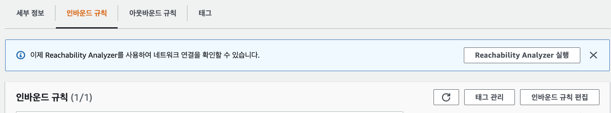

# Day03 - Shell 연습, RDS, S3와 CloudFont

- [Day03 - Shell 연습, RDS, S3와 CloudFont](#day03---shell-연습-rds-s3와-cloudfont)
  - [Shell 연습](#shell-연습)
    - [Shell](#shell)
    - [shell의 기능](#shell의-기능)
    - [쉘 예시](#쉘-예시)
    - [쉘 환경 변수](#쉘-환경-변수)
    - [Shell 문법](#shell-문법)
    - [쉡 스크립트 조건문](#쉡-스크립트-조건문)
    - [쉘 스크립트 반복문](#쉘-스크립트-반복문)
    - [쉘 스크립트 함수 정의](#쉘-스크립트-함수-정의)
    - [Shell 실행](#shell-실행)
  - [RDS](#rds)
  - [S3 - cloudFont](#s3---cloudfont)

</br>

## Shell 연습

</br>

|            vi            |
| :----------------------: |
|  |

</br>

- **i) 명령 모드(command mode)**

  - 처음 vi 명령어로 vi를 시작하게 되면 들어간다.
  - 여기서는 **방향키를 이용하여 커서를 이동**할 수 있으며,  **"dd" 나 "yy" 로 한 줄 삭제 및 한 줄 붙여넣기**, 또는 **"x" 명령어로 글자 하나를 삭제**할 수 있다.

- **ii) 입력 모드(insert mode)** 
  - **명령모드에서 "i" 나 "a" 명령**을 통해서 입력 모드로 넘어 갈 수 있다.

  - 입력모드로 가게되면, **자유롭게** 코드나 글을 **작성**을 할 수 있고
  - **명령 모드로 다시 돌아오려면 "ESC"**를 누르면 됩니다.  ("i" 명령은 커서가 현재 위치한 부분에서 부터, "a"는 커서 바로 다음 부분부터)

- **iii) 마지막 행 모드(Last line mode)** 
  - 마지막행 모드는 **명령모드에서 ":" (콜론) 을 입력**하면 화면 맨 밑단에 :**\_\_** 하며 입력을 할수 있는 공간이 나온다.
  - 여기서 현재까지 내가 작성한 이 내용을 저장하고 vi를 종료(wq)할지, 그냥 종료(q, q!)할지 등을 입력할 수 있습니다.

</br>

- vi 커서 이동

| 커서  |               설명               |
| :---: | :------------------------------: |
|   h   |        왼쪽으로 커서 이동        |
|   j   |         아래로 커서 이동         |
|   k   |          위로 커서 이동          |
|   l   |       오른쪽으로 커서 이동       |
|   w   | 오른쪽 한 단어의 끝부분으로 이동 |
|   e   | 오른쪽 한 단어의 끝부분으로 이동 |
|   b   |  왼쪽 한 단어의 앞부분으로 이동  |
| enter |      한 행 아래로 커서 이동      |
|   ^   |         행의 맨 왼쪽으로         |
|   $   |          행의 맨 끝으로          |
|   H   |             맨 위로              |
|   M   |               중간               |
|   L   |          화면 맨 아래로          |

</br>

- 문자, 행, 삽입 명령어

| 커서 |             설명              |
| :--: | :---------------------------: |
|  a   | 현재 커서 오른쪽에서 입력모드 |
|  A   |   행의 맨 끝에서 입력 모드    |
|  i   |    현재 커서에서 입력 모드    |
|  I   |  행의 첫 번째에서 입력 모드   |
|  o   |  커서 아래에 행에서 입력모드  |
|  O   |   커서 위에 행에서 입력모드   |
| esc  |             종료              |
|  dd  |          한 줄 삭제           |
|  x   |         한 글자 삭제          |
|  yy  |        한 줄 붙여넣기         |

</br>

- 마지막 행 모드

- wq : 저장하고 종료
- q! : 그냥 종료

</br>

### Shell

</br>

> 리눅스의 쉘은 명령어와 프로그램을 실행할 때 사용하는 인터페이스이다.

</br>

|             Shell              |
| :----------------------------: |
|  |

</br>

### shell의 기능

- 사용자와 커널 사이에서 명령을 해석해 전달하는 `명령어 해석기 기능`
- 쉘은 자체 내에서 프로그래밍 기능이 있어서 프로그램을 작성한다.
- 사용자 환경 설정의 기능 - 초기화 파일 기능을 이용하여 사용자의 환경을 설정할 수 있다.

</br>

### 쉘 예시

|              shell practice               |
| :---------------------------------------: |
|  |

</br>

|              shell result               |
| :-------------------------------------: |
|  |

</br>

### 쉘 환경 변수

</br>

> 환경 변수는 특정한 의미로 설정된 값을 의미한다.  
> HOME이라는 사용자 계정의 홈 디렉토리가 있을 때  
> 이를 사용하려면 $HOME을 입력하면 된다.
> 유용하게 사용될 변수 및 설정해야 하는 값을 설정해 두는 것!

</br>

|                 쉘 환경 변수                 |
| :------------------------------------------: |
|  |

</br>

|                환경 변수 실습                |
| :------------------------------------------: |
|  |

</br>

### Shell 문법

</br>

```shell
#!/bin/sh
name="Joo-PE"
echo $name
echo First: $1, Second $2
```

- #으로 시작하는 단어와 행은 주석으로 처리 됨.
- $0은 스크립트 파일의 이름으로 확장됨.
  - source 명령으로 실행하는 경우 쉘의 이름(bash)으로 확장 됨.
- $1은 첫 번째 인수, $2는 두 번째 인수로 확장 됨
- 스크립트가 복잡하다면 적절한 echo 명령을 넣는 것이 좋음.
- **변수=값**을 사용하여 변수에 값을 지정하고 **$변수**를 사용하여 값을 추출할 수 있음
  - `등호(=)의 좌우에 공백이 있으면 안됨`
- **bash -x script_file**과 같이 실행하면 수행되는 명령을 확인할 수 있음.(디버깅 모드)

|                     shell 디버깅                      |
| :---------------------------------------------------: |
|  |

</br>

### 쉡 스크립트 조건문

</br>

```shell
#!/bin/sh
name="Jung"
echo $name
echo First: $1

if [ $1 == "hello" ];then
        echo "hi hello"
fi
```

</br>

> if문 주의점 띄어쓰기 유의해야한다

</br>

|                  쉘 스크립트 조건문 결과                   |
| :--------------------------------------------------------: |
|  |

</br>

- else if도 사용 가능

```shell
#!/bin/bash

val="hello"

if [ $val == "hello" ];then
  echo "hello"
elif [ $val == "hi" ]; then
  echo "hi"
else
  echo "else"
fi
```

</br>

### 쉘 스크립트 반복문

</br>

```shell
#!/bin/sh
name="Jung"

echo n : $1

for ((c=1; c<=$1; c++))
do
        echo "value : $c"
done
```

|                  쉡 반복문 결과                   |
| :-----------------------------------------------: |
|  |

</br>

```shell
#!/bin/bash

for val in {1..5}
do
  echo ${val}
done
```

> for in도 가능한데,  
> 인자를 받아서 처리가 안된다... 안되나..?

</br>

### 쉘 스크립트 함수 정의

</br>

```shell
#!/bin/sh
name="Jung"

echo n : $1

for c in {1..10}
do
        echo "value : ${c}"
done

test_fucn(){
        echo "hello, world"
}

test_func
```

</br>

|                shell 함수 실행 결과                |
| :------------------------------------------------: |
|  |

</br>

### Shell 실행

- ./test.sh
- sh test.sh
- bash test.sh

</br>

</br>

## RDS

</br>

> RDS는 AWS 클라우드에서 관계형 데이터베이스를 더 쉽게 설치,  
> 운영 및 확장할 수 있는 웹 서비스입니다.

</br>

|      rds 검색 후 들어오기      |
| :----------------------------: |
|  |

</br>

|        DB 인스턴스 클릭        |
| :----------------------------: |
|  |

</br>

> DB 인스턴스 클릭하기

</br>

|            데이터 베이스 생성             |
| :---------------------------------------: |
|  |

</br>

> 이후 본인 설정에 맞게 DB 설정

</br>

|             보안 그룹 설정              |
| :-------------------------------------: |
|  |

</br>

> 보안 그룹 들어간 후

</br>

|             보안 그룹 설정              |
| :-------------------------------------: |
|  |

> 접속하는 것에대한 룰을 설정하는 `인바운드 규칙 편집` 클릭

</br>

|          내 ip 주소 입력           |
| :--------------------------------: |
|  |

</br>

> 외부 공인 ip 주소로 입력해야한다.

</br>

|               datagrip 연결               |
| :---------------------------------------: |
|  |

</br>

> host에는 rds 엔드포인트 입력
> rds 생성시 입력했던 user와 pw 입력

</br>

## S3 - cloudFont

- S3

> Amazon Simple Storage Service(Amazon S3)는 업계 최고의 확장성, 데이터 가용성, 보안 및 성능을 제공하는 객체 스토리지 서비스

</br>

|             버킷 만들기             |
| :---------------------------------: |
|  |

</br>

|             이미지 업로드 하기             |
| :----------------------------------------: |
|  |

</br>

|             이미지 업로드 하기 2             |
| :------------------------------------------: |
|  |

</br>

|             이미지 업로드 완료             |
| :----------------------------------------: |
|  |

> 업로드가 완료된 이미지로 들어간 후

</br>

|             이미지 열기             |
| :---------------------------------: |
|  |

> 이미지 열기 버튼을 클릭하면  
> 이미지의 링크로 들어가서 사진을 확인할 수 있다.

</br>

- 현재 객체 url 연결하면

```XML
<Error>
  <Code>AccessDenied</Code>
  <Message>Access Denied</Message>
  <RequestId>K4TD06A311HHANMY</RequestId>
  <HostId>GJrpS3hhShUBBomTnL4i64XwzW/IkbN1nLtNOK/YpJF94hJNyv24a7au4e7Cb+Tzn9HGvqWACU8=</HostId>
</Error>
```

> 권한이 막혀있는 것을 볼 수 있다.  
> 이제 정책을 살펴보자!

</br>

|             권한 들어가기             |
| :-----------------------------------: |
|  |

> 권한 들어간 후 편집 클릭

|             편집에서 퍼블릭 엑세스 허용해주고, 밑에 경고 확인 클릭             |
| :----------------------------------------------------------------------------: |
|  |

</br>

> 그후 다시 객체 URL 연결하면  
> 외부에서 파일을 열람할 수 있다!

</br>

|        정책 설정         |
| :----------------------: |
|  |

</br>

> 버킷 정책에서 편집 클릭

</br>

|          정책 생성기 클릭           |
| :---------------------------------: |
|  |

</br>

> arn 주소 기억하기

|    정책 생성기 들어와서 옵션 적기    |
| :----------------------------------: |
|  |

> 적은 후에 add statement 클릭 후
> Generate Policy 클릭

</br>

|             정책 변경 적용              |
| :-------------------------------------: |
|  |

> json으로 생성된 것 붙여 넣은 후  
> 하위 디렉토리 연결하기 위해 `/*` 붙이기

</br>

|              정적 웹사이트 호스팅              |
| :--------------------------------------------: |
|  |

</br>

|             정적 웹사이트 호스팅2              |
| :--------------------------------------------: |
|  |

> 활성화 시키고 인덱스 문서에 index.html 입력

</br>

- cloud front

> Amazon CloudFront는 .html, .css, .js 및 이미지 파일과 같은 정적 및 동적 웹 콘텐츠를 사용자에게 더 빨리 배포하도록 지원하는 웹 서비스  
>  CloudFront는 엣지 로케이션이라고 하는 데이터 센터의 전 세계 네트워크를 통해 콘텐츠를 제공

</br>

> CDN을 사용하여 origin 서버가 아닌 edge server를 사용하여  
> 더 빨리 배포되도록 지원해준다!

</br>

|                    CloudFront                    |
| :----------------------------------------------: |
|  |

</br>

|                 클라우드 프론트 생성                  |
| :---------------------------------------------------: |
|  |

</br>

> 위의 원본도메인 설정하고  
> 하위 뷰어 설정 신경을 써줘야한다.
