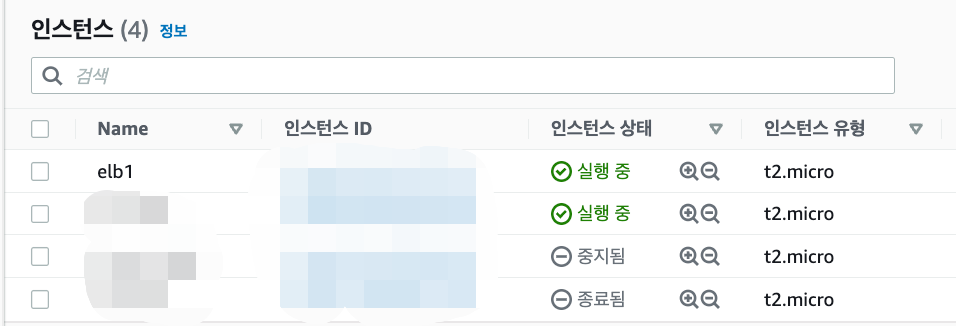
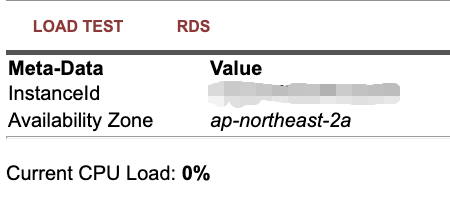
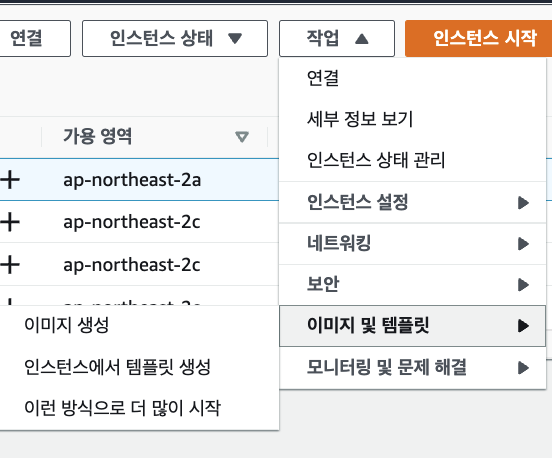
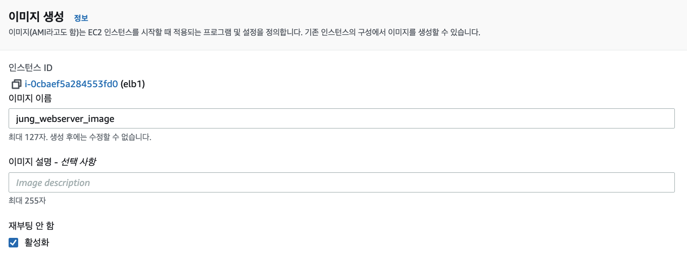
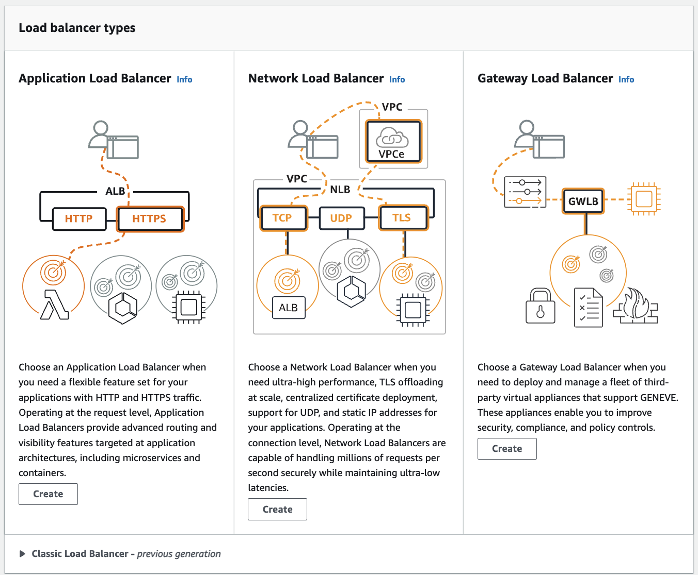

# Day 04 - CloudWatch, ELB, Lambda

- [Day 04 - CloudWatch, ELB, Lambda](#day-04---cloudwatch-elb-lambda)
  - [CloudWatch](#cloudwatch)
  - [ELB](#elb)
  - [Lambda](#lambda)

 

## CloudWatch

 

> CloudWatch는 Amazon Web Services(AWS) 리소스 및 AWS에서 실행되는 애플리케이션을 실시간으로 모니터링한다.  
> CloudWatch를 사용하여 리소스 및 애플리케이션에 대해 측정할 수 있는 변수인 지표를 수집하고 추적

 

|                Cloud Watch                 |
| :----------------------------------------: |
|  |

 

 

## ELB

 

|             ELB              |
| :--------------------------: |
|  |

 

- [aws docs elastic load balancing](https://docs.aws.amazon.com/ko_kr/elasticloadbalancing/latest/userguide/how-elastic-load-balancing-works.html)

 

> Elastic Load Balancing은 둘 이상의 가용 영역에서 EC2 인스턴스, 컨테이너, IP 주소 등 여러 대상에 걸쳐 수신되는 트래픽을 자동으로 분산합니다.  
> 등록된 대상의 상태를 모니터링하면서 상태가 양호한 대상으로만 트래픽을 라우팅한다.

 

- Elastic Load Balancing은 다음 유형의 로드 밸런서를 지원
  - Application Load Balancer
  - Network Load Balancer
  - Gateway Load Balancer
  - Classic Load Balancer

 

|                    교차 영역 로드 밸런싱                     |
| :----------------------------------------------------------: |
|  |

 

> ELB 두 개를 구성하여 로드밸런스를 두고  
> 각각의 서버에게 로드밸런싱 시켜주는 것.
> 앞단에서는 ELB만 바라보게 한다!

 

|               instance 하나 생성                |
| :---------------------------------------------: |
|  |

 

- 보안그룹에서 http 포트 하나 열어놓기
- 고급세부 정보에 사용자 테이터 집어넣기

 

|             퍼블릭 ip 주소로 접속             |
| :-------------------------------------------: |
|  |

 

|    AMI 생성하기 위해 이미지 생성 클릭     |
| :---------------------------------------: |
|  |

 

|              이미지 생성               |
| :------------------------------------: |
|  |

 

- 재부팅 안함 활성화 클릭해야 한다.
  - 실제 운영서버면 서버가 내려갔다가 다시 올라간다!
- 이후 만든 ami로 인스턴스 시작 하기
  - 이번에는 가용영역 C로!

 

|                 Application 단에서 load balancer                 |
| :--------------------------------------------------------------: |
|  |

 

- 처음 생성한 elb1 인스턴스와 이미지를 통해 만든 인스턴스를 로드밸런서로 묶는 과정

 

## Lambda

 

> Lambda는 서버를 프로비저닝하거나 관리하지 않고도 코드를 실행할 수 있게 해주는 컴퓨팅 서비스입니다. Lambda는 고가용성 컴퓨팅 인프라에서 코드를 실행하고 서버와 운영 체제 유지 관리, 용량 프로비저닝 및 자동 조정, 코드 및 보안 패치 배포, 코드 모니터링 및 로깅 등 모든 컴퓨팅 리소스 관리를 수행

- [aws docs lambda](https://docs.aws.amazon.com/ko_kr/lambda/latest/dg/welcome.html)

 
