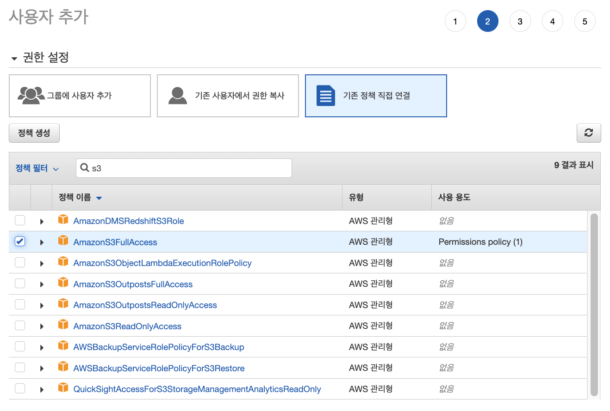

# Day05 - CI/CD, Elastic-beanstalk

- [Day05 - CI/CD, Elastic-beanstalk](#day05---cicd-elastic-beanstalk)
  - [CI/CD](#cicd)
    - [AWS에서의 CI/CD](#aws에서의-cicd)
    - [Local에 있는 소스코드를 S3에 올려서 Code deploy로 EC2에 배포하기](#local에-있는-소스코드를-s3에-올려서-code-deploy로-ec2에-배포하기)
  - [Elastic-beanstalk](#elastic-beanstalk)

## CI/CD

</br>

- [레드햇 참고](https://www.redhat.com/ko/topics/devops/what-is-ci-cd)

</br>

> CI/CD의 기본 개념은 지속적인 통합, 지속적인 서비스 제공, 지속적인 배포입니다.  
> CI/CD는 새로운 코드 통합으로 인해 개발 및 운영팀에  
> 발생하는 문제를 해결하기 위한 솔루션입니다.

</br>

|             CI / CD             |
| :-----------------------------: |
|  |

</br>

- 지속적 통합
- 지속적 제공
- 지속적 배포

</br>

### AWS에서의 CI/CD

</br>

- [Code Commit](https://docs.aws.amazon.com/ko_kr/codecommit/?id=docs_gateway)
  - git으로 github처럼 repository 제공해주는 서비스
- [Code Deploy](https://docs.aws.amazon.com/ko_kr/codedeploy/?id=docs_gateway)
  - EC2, 온프레미스, 서버리스 Lambda 함수 혹은 EC2 서비스로 배포 자동화하는 배포 서비스
- [Code Build](https://docs.aws.amazon.com/ko_kr/codebuild/?id=docs_gateway)
  - 소스 코드를 컴파일하고 단위 테스트를 실행하여 배포할 준비가 완료된 아티팩트 생성
- [Code Pipeline](https://docs.aws.amazon.com/ko_kr/codepipeline/?id=docs_gateway)
  - 소프트웨어 릴리스에 필ㅇ한 단계를 모델링, 시각화 및 자동화하는 데 사용할 수 있는 지속적 전달 서비스

</br>

### Local에 있는 소스코드를 S3에 올려서 Code deploy로 EC2에 배포하기

</br>

|        IAM에서 역할 만들기 - ec2 선택        |
| :------------------------------------------: |
|  |

</br>

- 1. EC2에서 S3에 있는 파일 가져오는 권한 추가

|                   EC2 선택                    |
| :-------------------------------------------: |
|  |

</br>

|             S3 권한 추가              |
| :-----------------------------------: |
|  |

</br>

|             역할 생성              |
| :--------------------------------: |
|  |

</br>

- 2. code deploy에서 ec2 접근 권한 추가

</br>

|             IAM에서 역할 만들기 - code deploy 선택              |
| :-------------------------------------------------------------: |
|  |

</br>

|             Code Deploy 권한 추가              |
| :--------------------------------------------: |
|  |

</br>

|             역할 생성              |
| :--------------------------------: |
|  |

</br>

- 3. EC2 인스턴스 생성 : jung-cicd-testserver

</br>

|             인스턴스 생성 시 iam 인스턴스 프로파일 설정              |
| :------------------------------------------------------------------: |
|  |

</br>

- 4. 사용자 추가

|              사용자 추가              |
| :-----------------------------------: |
|  |

</br>

|               권한 설정               |
| :-----------------------------------: |
|          |
|  |

</br>

- 5. 이제 전에 만들었던 jung-cicd-testserver 인스턴스 접속

</br>

- 6. code deploy agent 설치

</br>

```sh
sudo yum update
sudo yum install ruby
sudo yum install wget
wget [https://aws-codedeploy-ap-northeast-2.s3.amazonaws.com/latest/install](https://aws-codedeploy-ap-northeast-2.s3.amazonaws.com/latest/install)
chmod +x install
sudo ./install auto
sudo service codedeploy-agent status
```

</br>

- 7. 체크 후 서버 나오기

|   sudo service codedeploy-agent status로 agent 체크    |
| :----------------------------------------------------: |
|  |

</br>

- 8. aws cli 없어서 설치

```sh
brew install awscli
which aws // 위치 확인
aws --version // 버전 확인
```

</br>

- 9. access key로 로그인
  - 비밀 액세스키 기억하던가
  - csv 저장하던가

</br>

|                   access key login                   |
| :--------------------------------------------------: |
|  |

</br>

- 10. s3 만들기

</br>

- 11. 이후 명령어로 mywebapp 배포

</br>

```sh
aws deploy create-application --application-name mywebapp
aws deploy push --application-name mywebapp --s3-location s3://aws-jaden-code-deploy-bucket/webapp.zip --ignore-hidden-files
```

</br>

</br>

## Elastic-beanstalk

</br>

</br>
