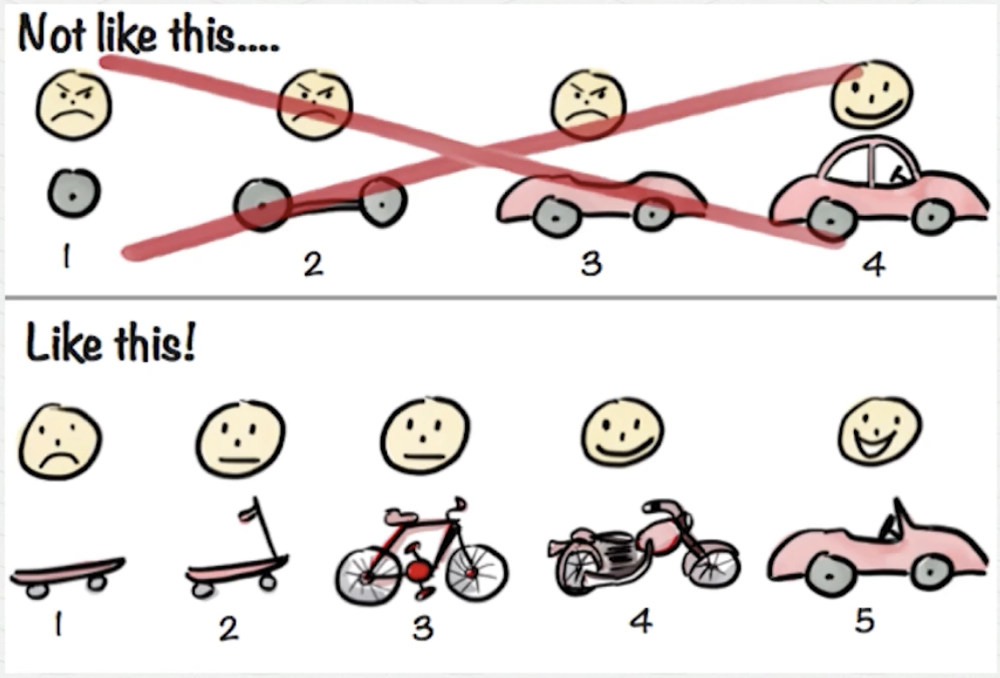

 

## 협업 1. 앞으로 배울 협업이란

 

> 스크럼 마스터가 glassdoor가 40위로 선정 되어 있음.  
> 미국에 상당히 많은 회사들이 스크럼 방식으로 일하고 있음.  
> 링크드인에서 2019년에 가장 전도 유망한 직업이 스크럼 마스터..

 
 
 

|       애자일하게 일하는 국내 조직들        |
| :----------------------------------------: |
|  |

> 카카오뱅크는 어떻게 혁신적인 서비스를 제공할 수 있었냐?  
> 그 이후 애자일의 트렌드가 붐을 일으켰다.

 
 
 

|                 개념                  |
| :-----------------------------------: |
|  |

 

> 스크럼이 애자일 방법론 중 하나.  
> 스크럼을 변형해서 만든 스포티 파이 모델을 쓰는 회사들도 있다.

 

## 협업 2. 애자일 스크럼 설명

 

| 시간 단위로 계획 세우는 사람 | 왕복 티켓만 들고 여행을 떠나는 사람 |
| :--------------------------: | :---------------------------------: |
|          Waterfall           |                Agile                |

 

- 계획 잘 세우고, 전략 -> 기획 -> 디자인 -> .. -> 개발
- 이런 것을 피할 수 있나?
- 이렇게 안할 수는 없나?
- 그러면 애자일은 계획을 안 세우나?

 
 
 

> 중간 팀에서 개발 팀을 고려해서 기획하고 디자인 해도  
> 개발팀에서 불가 할 경우 다시 역순으로 올라가서 수정해야함...
> 워터폴은 사전에 발생할 문제들을 예상 가능하다고 생각하는 것..
> 애자일은 상황에 맞는 계획들을 세우겠다. 짧은 일에만 집중 하겠다.

 

|                Waterfall vs Agile                 |
| :-----------------------------------------------: |
|  |

 

> 운송수단이 마차밖에 없다는 세상이라고 가정할 때  
> 세상에 저런식으로 자동차가 나올 수 있는가?
