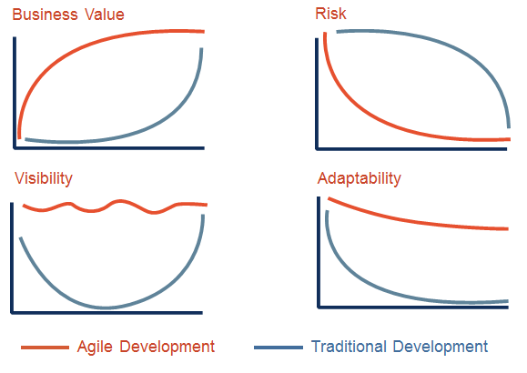

 

## 협업 1. 앞으로 배울 협업이란

 

> 스크럼 마스터가 glassdoor가 40위로 선정 되어 있음.  
> 미국에 상당히 많은 회사들이 스크럼 방식으로 일하고 있음.  
> 링크드인에서 2019년에 가장 전도 유망한 직업이 스크럼 마스터..

 
 
 

> 카카오뱅크는 어떻게 혁신적인 서비스를 제공할 수 있었냐?  
> 그 이후 애자일의 트렌드가 붐을 일으켰다.

 
 

- 애자일
  - 칸반
  - XP
  - 스크럼

 

> 스크럼이 애자일 방법론 중 하나.  
> 스크럼을 변형해서 만든 스포티 파이 모델을 쓰는 회사들도 있다.

 

## 협업 2. 애자일 스크럼 설명

 

| 시간 단위로 계획 세우는 사람 | 왕복 티켓만 들고 여행을 떠나는 사람 |
| :--------------------------: | :---------------------------------: |
|          Waterfall           |                Agile                |

 

- 계획 잘 세우고, 전략 -> 기획 -> 디자인 -> .. -> 개발
- 이런 것을 피할 수 있나?
- 이렇게 안할 수는 없나?
- 그러면 애자일은 계획을 안 세우나?

 
 
 

> 중간 팀에서 개발 팀을 고려해서 기획하고 디자인 해도  
> 개발팀에서 불가 할 경우 다시 역순으로 올라가서 수정해야함...
> 워터폴은 사전에 발생할 문제들을 예상 가능하다고 생각하는 것..
> 애자일은 상황에 맞는 계획들을 세우겠다. 짧은 일에만 집중 하겠다.

 

|                Waterfall vs Agile                 |
| :-----------------------------------------------: |
|  |

 

> 운송수단이 마차밖에 없다는 세상이라고 가정할 때  
> 세상에 저런식으로 자동차가 나올 수 있는가?
> 핵심은 짧은 기간에 요구사항을 발전시키는 것 -> 점진적 개발

 

## 협업 3. 멀티태스킹

 

- 1~10, A~J, 가~차 적어보기

> 한 가지 일을 진득하게 집중해서 해라.  
> 사고와 환경을 다시 이해하는데 비용이 더 크다.  
> 멀티태스킹 별로다..  
> 그런데 상황마다 다른데 어떻게..?

 

## 협업 4. Agile Value Proposition

 

|              애자일 가치               |
| :------------------------------------: |
|  |

 

- 가시성
- 적응성
- 사업적 가치
- 위험

 

## 협업 5. 폭포수모델/애자일 FAQ

 

- Q1. 워터폴, 그니까 폭포수 모델은 장점이 하나도 없나요?

> 아이폰이 처음 출시됐던 상황이었을때는 애자일이 맞지만  
> 기존 제품을 찍어내는 안정적이고 검증된 프로세스가 있다면 워터폴도 좋다/

 

- Q2. 폭포수 모델이 좋을지 애자일이 좋을지 어떻게 판단하나요?

- 커네빈
  - 복합
    - scrum
    - 창의력 & 혁신
    - 혁신적인 새 제품 개발
    - 현존하는 제품의 혁신적 기능 변화
  - 복잡
    - 칸반/ 스크럼/ 하이브리드
    - SIX SIGMA
    - 전문가의 진단 필요
    - 여러가지 대안 중 좋은 판단으로 결정
    - 매일 반복되는 소프트웨어 관리
  - 혼돈
    - 빠른 반응 요구
    - 위기 상황 대처 피해 예방
    - 즉각적이고 단호한 대처
    - 책임을 지고 행동할 사람 필요
  - 단순
    - WATERFALL
    - 명확한 정답과 알려진 해결법
    - 정해진 방식의 업무 영역
    - 정해진 제품 반복 제작
  - 무질서

 

- Q3 저희는 IT 업계가 아닌데도 애자일이나 스크럼 방식으로 일할 수 있나요?

> 굳이 소프트웨어를 만드는 팀이나 회사가 아니더라도 가능하다.  
> 유튜브를 영상컨텐츠를 만드는 팀이었는데 방송업계에서도 애자일이 유용할 수 있겠다.  
> 아이디어가 필요하다거나, 빠르게 개선하고싶은 곳에선 적합할 것같다.

 

- Q4. 애자일이랑 폭포수 모델 그 중간은 없나요?
