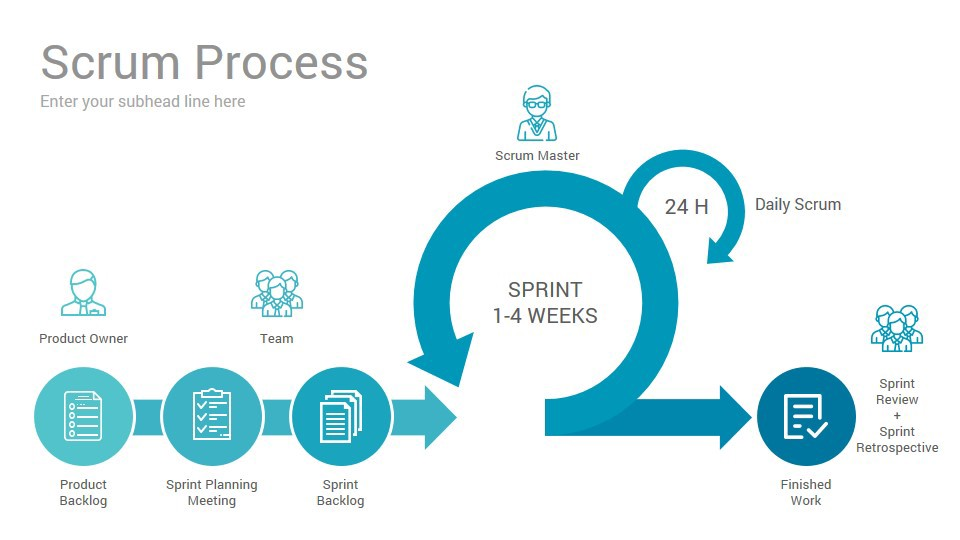

## 협업 6. 애자일코치 스크럼 마스터

- 스크럼 팀
  - 프로덕트 오너
  - 스크럼 마스터
  - 개발팀/개발자들

 

- 스크럼 마스터, 애자일 코치의 역할
  - 첫째, 스크럼과 애자일의 가치를 잊지 않게 해주는 사람.
  - 둘째, 보다 더 효율적이고 효과적으로 일하는 방법을 고민하는 사람.
  - 셋째, 스크럼 마스터와 애자일 코치의 별명은 헌신적인 리더!
    - 갈등 해소와 문제 해결을 위한 조력자
    - 스스로 질문을 던져서 해결할 수 있게....?

 

## 협업 7. 프로덕트 오너

 

- 기획자
  - 이 서비스의 어떤 것이 필요한지, 개선사항을 고민하거나
  - 다른 팀들의 요구사항을 정리해서 팀원들에게 전달, 프로덕트 오너와 유사
- 프로덕트 오너
  - 방향성, 해야되는 일을 정의 내리는 역할
  - 첫째, 모든 이해관계자의 입장을 대변하는 사람
  - 둘재, 방향을 정하고 결정을 내리는 사람.
  - 끊임없이 배우고 또 배우는 사람...
- PM
  - 일정관리 관점에서는 스크럼마스터와 겹쳐 있기도 하고...

 

## 협업 8. 개발자팀\_개발자들

 

- 첫째, 스스로 주체적으로 일하는 사람들..
- 교차기능적으로 협업하는 T자형 인재
  - 그냥 하나는 전문적이고 하나는 얕은거..
- 기술적 채무를 만들지 않는 사람들
  - 개인적인 사견으로 기술적 부채가 반드시 나쁜 것인지는 모르겠다..?

 

## 협업 9. 역할 FAQ

 

- Q1. 스크럼마스터나 프로덕트 오너가 아닌데도 굳이 그 사람들이 뭘 하는지 알아야 하나요?

> 왜 알아야하냐면은... 내가 할 수도 있다..?  
> 한 팀으로 하는데, 저 사람의 역할과 책임은 무엇인지 알고 있어야  
> 서로 소통하면서 같이 일할 수 있다...
> 서로의 업무가 투명하게 공개되어야 한다.

 

## 협업 10. 스크럼 개요

 

|           스크럼            |
| :-------------------------: |
|  |

 
