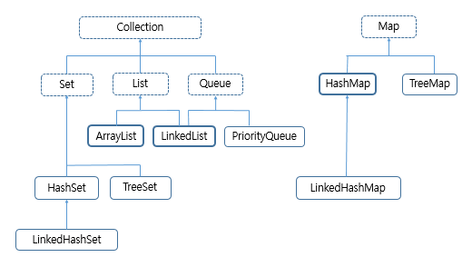

# Collection

</br>

|              Collections 도표              |
| :----------------------------------------: |
|  |

- Collection 주요 메서드

|       method       | return type  |
| :----------------: | :----------: |
|       size()       |     int      |
|     isEmpty()      |   boolean    |
| contains(Object o) |   boolean    |
|     iterator()     | Iterator\<E> |
|     toArray()      |   Object[]   |
|      add(E e)      |   boolean    |
|  remove(Object o)  |   boolean    |
|      clear()       |     void     |

- Iterator

|                    method                    | return type |
| :------------------------------------------: | :---------: |
|                  hasNext()                   |   boolean   |
|                    next()                    |      E      |
| forEachRemaining(Consumer<? super E> action) |    void     |

</br>

```java

default void forEachRemaining(Consumer<? super E> action) {
        Objects.requireNonNull(action);
        while (hasNext())
            action.accept(next());
    }


```

```java

public static <T> T requireNonNull(T obj) {
        if (obj == null)
            throw new NullPointerException();
        return obj;
    }

```

</br>

> forEachRemaining은 모든 요소가 처리되거나 작업에서 예외가 발생 할 때까지 나머지 각 요소에 대하여 지정된 작업을 수행하는 함수.

```java
public class ArrayListPractice {

    public static void main(String[] args) {

        List<Integer> list = new ArrayList<>();

        for (int i = 0; i < 10; i++) {
            list.add(i);
        }

        Iterator<Integer> iter = list.iterator();
        iter.forEachRemaining((i) -> System.out.println(i));

    }
}
```

## List

</br>

### ArrayList vs LinkedList

|           ArrayList vs LinkedList            |
| :------------------------------------------: |
|  |

</br>

- 일반적 상황에서 수행속도

|        | ArrayList | LinkedList |
| :----: | :-------: | :--------- |
|  add   |   O(1)    | O(1)       |
| remove |   O(n)    | O(n)       |
|  get   |   O(1)    | O(n)       |

</br>

- ArrayList(조회) vs LinkedList(삭제)

> 위의 일반적인 상황에서 remove연산의 시간 복잡도가 같다고 했지만 LinkedList가 더 빠르다.  
> Arraylist는 특정 원소의 위치를 찾고 삭제 할 경우 뒤의 원소를 당겨오는 연산을 필요하지만  
> LinkedList는 위치만 찾으면 되기 때문.
>
> 또한 삽입 역시 마지막 원소에 추가하는 경우 큰 차이는 없으나
> 중간 위치나 처음 위치에 추가할 경우
> 추가한 후 밀어내는 연산을 필요로 하기때문에 ArrayList가 불리
>
> 그러나 LinkedList는 순서 정보가 없기 때문에 조회가 오래 걸린다는 단점이 있다.  
> LinkedList는 head나 tail에 대한 정보 역시 갖고 있기 때문에, 메모리에서 불리

</br>

- 요약

> 조회는 `ArrayList`
> 중간 원소 삭제 연산 및 추가는 `LinkedList`

## Queue

- 주요 메서드

|  method   | return type |
| :-------: | :---------: |
|  add(E)   |   boolean   |
| offer(E)  |   boolean   |
| remove()  |      E      |
|  poll()   |      E      |
| element() |      E      |
|  peek()   |      E      |

- Queue 메서드 차이점

> add, remove, poll()은 Exception을 터트린다
> offer는 추가 연산 실패시 false를
> peek()과 poll()은 null 반환

</br>

### PriorityQueue

</br>

```java

import java.util.Collections;
import java.util.Comparator;
import java.util.Iterator;
import java.util.PriorityQueue;

public class PriorityQueuePractice {

    public static void main(String[] args) {

        // default 오름차순
        PriorityQueue<Integer> pq = new PriorityQueue<>();

        // Collections 이용해서 내림차순
        PriorityQueue<Integer> pq1 = new PriorityQueue<>(Collections.reverseOrder());

        // lamda 이용해서 절댓값을 기준으로 오름차순, 같으면 양의 정수가 우선순위
        PriorityQueue<Integer> pq2 = new PriorityQueue<>((o1, o2) -> {

            int abs1 = o1 < 0 ? -o1 : o1;
            int abs2 = o2 < 0 ? -o2 : o2;

            if(abs1 == abs2) return o1 < o2 ? 1 : -1;
            else
                return abs1-abs2;
        });

        // Comparator 이용해서 절댓값을 기준으로 오름차순, 같으면 양의 정수가 우선순위
        PriorityQueue<Integer> pq3 = new PriorityQueue<>(new Comparator<Integer>(){

            @Override
            public int compare(Integer o1, Integer o2) {
                int abs1 = o1 < 0 ? -o1 : o1;
                int abs2 = o2 < 0 ? -o2 : o2;

                if(abs1 == abs2) return o1 < o2 ? 1 : -1;
                else
                    return abs1-abs2;
            }
        });

        // Comparable interface 상속 받고 임금 높은 직원 순
        PriorityQueue<Employee> pq4 = new PriorityQueue<>();

        pq4.offer(new Employee("Jung",100000));
        pq4.offer(new Employee("Na",50000));

        pq4.iterator().forEachRemaining(E -> System.out.println(E));
    }

    private static class Employee implements Comparable<Employee>{

        private String name;
        private int wage;

        public Employee(String name, int wage) {
            this.name = name;
            this.wage = wage;
        }

        @Override
        public int compareTo(Employee o) {
            return o.wage-this.wage;
        }

        @Override
        public String toString() {
            return "Employee{" +
                    "name='" + name + '\'' +
                    ", wage=" + wage +
                    '}';
        }
    }
}

```

</br>

## Map

</br>

### HashMap

</br>

### LinkedMap

</br>

### TreeMap

</br>

## Set

</br>

### HashSet

</br>

### LinkedHashSet

</br>

### TreeSet
