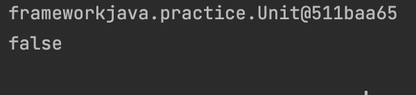
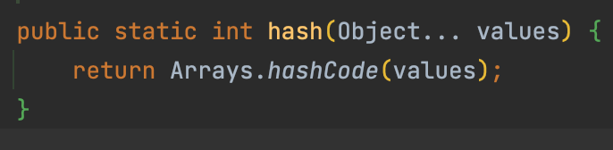
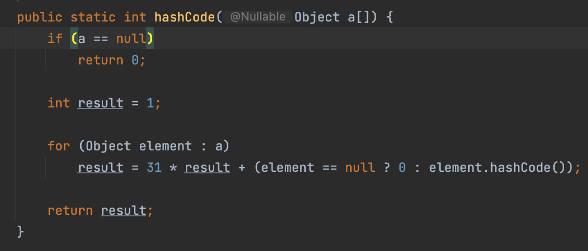

# Object class

- class

> 객체를 만들어 내기 위한 틀  
> 연관되어 있는 변수와 메서드의 집합

- object

> 소프트웨어에서 구현할 대상
> 클래스를 토대로 생성된 실체

- instance

> object를 실체화 한 대상을 Instance라고 하며  
> 이 instance가 메모리에 할당 된다.

</br>

## Object Class 주요 메서드

|      method      |          description          |
| :--------------: | :---------------------------: |
|    toString()    | 객체의 원소를 string으로 반환 |
| equals(Object o) |           객체 비교           |
|  int hashCode()  |  객체간의 논리적 비교시 사용  |

</br>

- toString(), equals(), hashCode() 구현 X

```java

package frameworkjava.practice;

public class Unit {

    Long id;
    Long level;
    String name;
    Long hp;

    public Unit(Long id, Long level, String name, Long hp) {
        this.id = id;
        this.level = level;
        this.name = name;
        this.hp = hp;
    }

}

```

</br>

```java

package frameworkjava.practice;

public class ObjectPractice {

    public static void main(String[] args) {

        Unit unit = new Unit(1L,20L,"monster", 500L);
        Unit unit2 = new Unit(1L,20L,"monster", 500L);

        System.out.println(unit); // toString이 정의 되지 않으면 instance 반환
        System.out.println(unit.equals(unit2)); // 객체 비교

    }
}

```



> Object의 toString()을 구현 하지 않아 instance를 그대로 출력 한다.  
> equals() 메소드를 구현 하지 않을때, 객체간의 instacne로 비교하여 false 반환  
> `즉, 우리가 일반적으로 원하는 변수의 논리적 동등이 아닌 인스턴스의 비교가 실행`

```java

package frameworkjava.practice;

import java.util.Objects;

public class Unit {

    Long id;
    Long level;
    String name;
    Long hp;

    public Unit(Long id, Long level, String name, Long hp) {
        this.id = id;
        this.level = level;
        this.name = name;
        this.hp = hp;
    }

    @Override
    public String toString() {
        return "Unit{" +
                "id=" + id +
                ", level=" + level +
                ", name=" + name +
                ", hp=" + hp +
                '}';
    }

    @Override
    public boolean equals(Object o) {
        if (this == o) return true;
        if (o == null || this.getClass() != o.getClass()) return false;
        Unit unit = (Unit) o;
        return this.hashCode() == unit.hashCode();
    }

    @Override
    public int hashCode() {
        return Objects.hash(id, level, name, hp);
    }

}

```

> 함수를 자세히 살펴보면 마지막 equals 함수에서 return 시 hashcode를 사용하여 객체의 논리적 동등 비교 결과가 반환됨을 알 수 있다.





</br>

> hashcode에서 java.util의 Objects.hash()를 호출하고  
> Arrays에서 hashcode 함수를 호출하는데  
> 각각의 element에 31을 곱한 값을 return 한다.

</br>

- [왜 31을 곱하는 걸까?](https://johngrib.github.io/wiki/Object-hashCode/)

</br>

## 정리

> Object의 toString(), equals(), hashCode()에 대해 알아보았다.  
> 각 class에서 위의 함수들을 오버라이딩 하여 사용하는 이유는 사용자가 논리적 값을 원하거나 논리적 동등 비교시 각 클래스의 인스턴스로는 원하는 결과를 얻을 수 없기때문이다.
