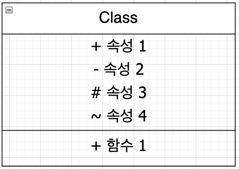
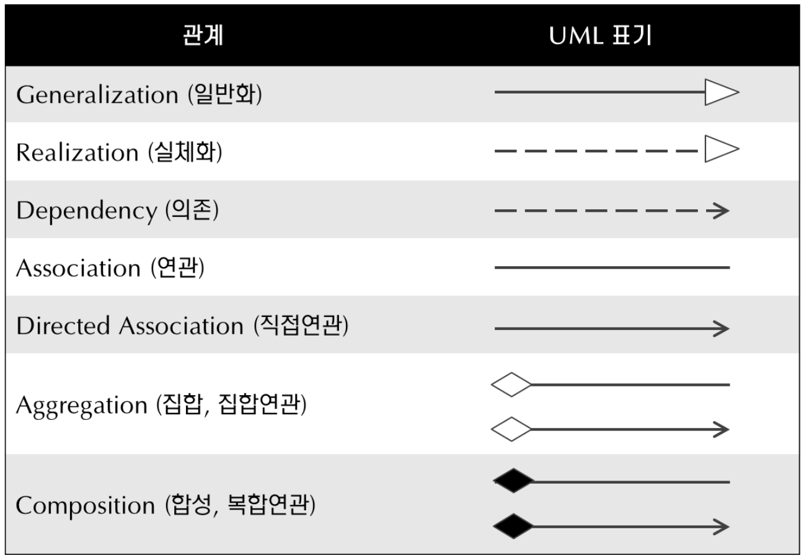

# UML

| 기호 | 접근제어자 |
| :--: | :--------: |
|  +   |   public   |
|  -   |  private   |
|  #   | protected  |
|  ~   |  default   |

 

|             UML 관계              |
| :-------------------------------: |
|  |

 

- 일반화

> 부모 클래스와 자식 클래스간의 상손 관계  
> 부모 클래스를 자식 클래스로 구체화 하는 것

 

- 실체화

> 인터페이스를 오버라이딩 하여 실제 기능으로 구현 하는 것  
> 인터페이스의 메소드를 구체화 하는 것

 

- 의존

> 참조하여서 클래스를 사용할 때를 의존 관계
> 해당 객체의 참조 계속 유지하는 것이 아님.
> 직접적으로 필드 선언해서 사용하는 것이 아님.

 

- 연관, 직접 연관

> 다른 객체의 참조를 가지는 필드를 의미
> 의존 관계와 혼동 주의  
> 화살표가 없는 것은 둘 다 서로를 소유할 수 있다는 것  
> 화살표가 갖는 것은 해당 클래스를 역할로 갖고 있다는 것

 

> 다른 객체의 참조를 필드로 갖지만  
> 외부 함수로 주입 받는 것

 

- 집합, 집합연관

> 클래스를 필드로 가질때 직접적으로 new로 생성 하지 않고 외부로 주입 받음 ex) set 함수

 

- 합성, 복합연관

> 클래스에서 직접 new로 생성한다는 것 ex) 생성자로 new해서 생명주기를 갖는다는 것

 

[UML reference](https://narup.tistory.com/32)
