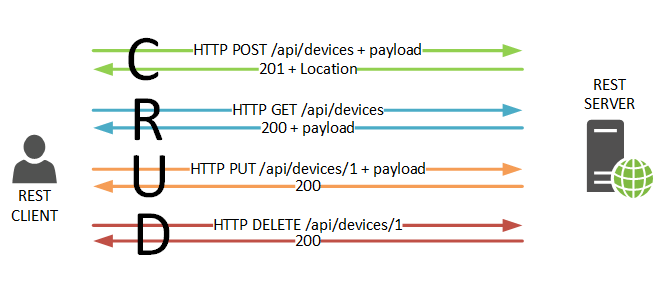
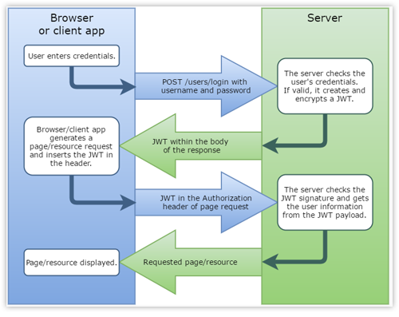
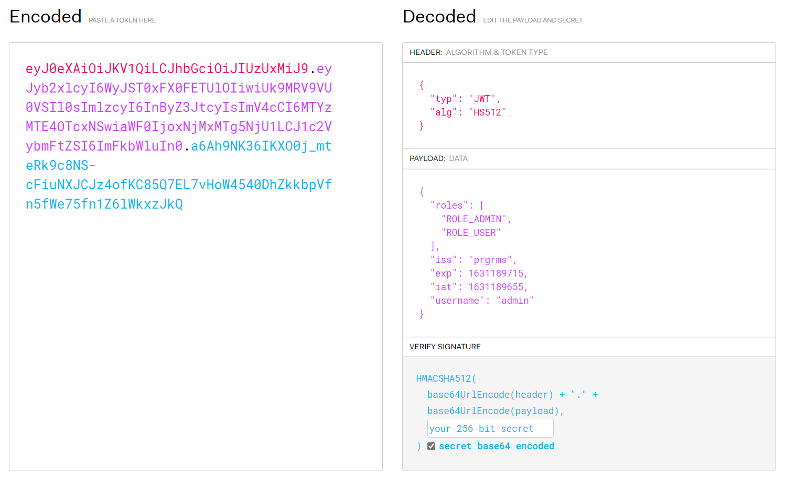
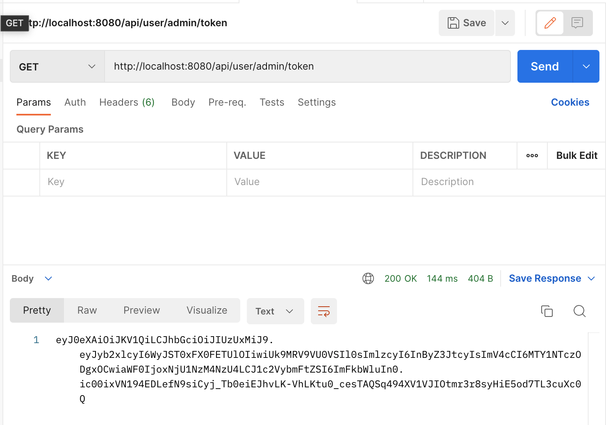
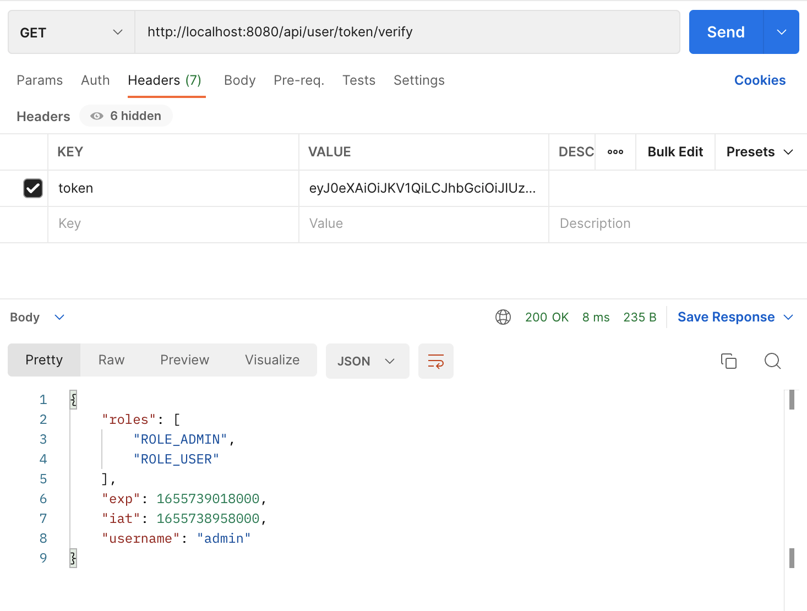

# 08. Spring Security with JWT Part. 1

## Rest API 서비스와 Stateless 아키텍처

</br>

- REST API

</br>

|           rest crud           |
| :---------------------------: |
|  |

</br>

> 두 서버간에 데이터를 교환하기 위한 인터페이스  
> uri는 뭐 자기 식별을 해야한다 등등 여러가지 규약 존재  
> 사실상 완벽하게 지킬 수 없는...

</br>

- Stateful vs Stateless

- Stateful 아키텍처

  - 세션을 사용하겠다는 것 자체가 서비스가 stateful
  - service layer에서 scale out 할 때 세션 클러스터가 필요
    - 멀티서버에서 반드시 필요
    - A서버에는 존재하는 세션이 B서버에 없다면..?
  - 세션 클러스터가 병목 지점이 되어 전체 성능에 악영향을 주거나, 장애가 발생할 경우 어떻게 할 것인지?
  - 보안성 측면 장점
    - 단일 사용자의 다중 로그인 컨트롤
    - 사용자의 유효성 체크
    - 강제 로그아웃 기능 구현이 쉽다~

- Stateless 아키텍처
  - scale out에서 당연히 장점
  - 보안성 측면 어려움
  - 무엇보다 stateless 기반으로 유의미한 서비스 개발이 어렵다..
    - 완전한 stateless 서비스는 정적 리소스(html,css,javascript)등을 서비스하는데 적합
  - stateless는 어떤식으로 사용자를 식별할지?

## JWT

> JWT는 Stateless 상태를 유지하며, 서버에서 사용자를 식별할 수 있는 수단을 제공하려한다.

- 일단 Sessiong cluster라는 컴포넌트를 관리하지 않아도 된다.
- 어떻게 보안성을 유지할 것인지..?

</br>

### JWT를 통한 클라이언트 인증 및 요청처리 플로우

</br>

|                 JWT flow                 |
| :--------------------------------------: |
|  |

</br>

- 클라이언트에서 인증 처리 요청
- 서버는 JWT 인증값을 바디에 실어서 응답
- 클라이언트는 JWT 토큰 값을 저장
- 이후 서버에 요청을 보낼 때 HTTP 헤더에 JWT 토큰 값을 실어서 보내게 된다.
- 서버는 클라이언트가 보낸 요청에서 JWT 토큰을 추출하고 JWT 토큰 값이 올바르다면 JWT를 통해 클라이언트가 어떤 사용자인지 식별
- 그 후 사용자에게 페이지와 자원을 응답.

</br>

- Session Id와 차이

> 세션 아이디는 그 자체로는 랜덤하게 생성 되고 나서 아무 의미가 없는 데이터  
> 서버에서 세션을 식별하기 위한 키로만 사용

</br>

- JWT 개요
  - JWT는 자체적으로 필요한 모든 정보를 지님(self-contained)
  - 토큰에 대한 메타정보(토큰 타입, 사용된 해시 알고리즘)
    - 사용자 정의 데이터
    - 토큰 유효성 검증을 위한 데이터
  - 인터넷 상에서 쉽게 전달 가능
    - URL-safe 텍스트로 구성되어 HTTP 프로토콜 어느 위치에든 들어갈 수 있음
  - 위변조 검증 가능
    - 토큰 위변조를 증명하는 서명도 포함

</br>

- JWT 구조

  - Header, Payload, Signature 세 부분으로 구성됨
  - Header, Payload, 세 부분을 Base64 url-safe 방식으로 인코딩하고 dot을 구분자로 결합함
    |jwt structure|
    |:-:|
    ||
  - Header : JWT를 검증하는 필요한 정보를 담고 있음.(토큰 타입, 사용된 알고리즘)
    - 알고리즘 : HMAC, RSA 방식 지원
    - 아래 그림에서 HS512는 HMAC using SHA-512의미
    - HMAC 알고리즘에서 비밀키는 최소한 알고리즘의 서명 길이만큼의 비트를 가져야 한다.
  - PAYLOAD

    - JWT를 통해 전달하고자 하는 데이터 - Claim set
      - claim 자체는 쉽게 말해 Key-Value 데이터 쌍을 의미함
    - `JWT 자체는 암호화 되는 것이 아니기 때문에 민감 정보 포함 X`
    - Reserved Claims, Public Claims, Custom Claims으로 구분 됨
      - Reserved Claims - 미리 등록된 Claims 필수적으로 사용할 필요는 없지만 사용을 권고함
        - iss - 토큰을 발급한 발급자(issuer)
        - exp - 만료시간 지난 토큰은 사용불가
        - nbf - Not Before의 의미로 해당 시간 이전에는 토큰 사용불가
        - iat - 토큰이 발급된 시각
        - jti - JWT ID로 토큰에 대한 식별자
    - Public Claims - 사용자 마음대로 쓸 수 있으나 충돌 방지를 위해 미리 정의된 이름으로 사용을 권고함
    - Custom Claims - 사용자 정의 Claims (Reserved, Public에 정의 된 이름과 중복되 않도록 함)
    - Signature

      - 토큰 생성 주체만 알고 있는 비밀키를 이용해 헤더에 정의된 알고리즘을 서명된 값
      - 토큰이 위변조 되지 않았음을 증명함

      ```java
      String concatenated = encodedHeader + '.' + encodedClaims;
      String token = base64URLEncode(hmaSha512(concatenated, key));
      ```

- JWT 장단점 - Stateful vs Stateless
  - 장점
    - `사용자 인증에 필요한 모든 정보는 토큰 자체에 포함하기 때문에 따로 스토리지가 필요 없음`
      - 수평 확장이 매우 쉬움 - Session Cluster 필요 없음
    - 따라서, Active User가 많은 서비스에서 JWT 사용이 유리함
      - Session을 사용할 경우 Active User 수 만큼 Session 저장해야 하기 때문에 스토리지 관리가 어려워짐
  - 단점
    - 토큰 크기를 가능한 작게 유지해야 함
      - 토큰 자체가 항상 HTTP 요청에 포함되어야 하기 때문에 토큰이 커질수록 불리함
    - 유효기간이 남아 있는 정상적인 토큰에 대해 강제적으로 만료처리가 어려움
      - Session을 사용할 경우 동시 Sessions 만료 처리 등 보안상 이점이 있음

</br>

## REST API with JWT 맛보기

</br>

```xml
  <dependency>
      <groupId>com.auth0</groupId>
      <artifactId>java-jwt</artifactId>
      <version>3.18.1</version>
  </dependency>
```

```yml
jwt:
  header: token
  issuer: prgrms
  client-secret: EENY5W0eegTf1naQB2eDeyCLl5kRS2b8xa5c4qLdS0hmVjtbvo8tOyhPMcAmtPuQ
  expiry-seconds: 60
```

</br>

- 그 다음에 @ConfigurationProperties를 사용하여 JwtConfigure 구현하기

```java
@Component
@ConfigurationProperties(prefix = "jwt")
public class JwtConfigure {

    private String header;

    private String issuer;

    private String clientSecret;

    private int expirySeconds;

    public String getHeader() {
        return header;
    }

    public void setHeader(String header) {
        this.header = header;
    }

    public String getIssuer() {
        return issuer;
    }

    public void setIssuer(String issuer) {
        this.issuer = issuer;
    }

    public String getClientSecret() {
        return clientSecret;
    }

    public void setClientSecret(String clientSecret) {
        this.clientSecret = clientSecret;
    }

    public int getExpirySeconds() {
        return expirySeconds;
    }

    public void setExpirySeconds(int expirySeconds) {
        this.expirySeconds = expirySeconds;
    }

    @Override
    public String toString() {
        return new ToStringBuilder(this, ToStringStyle.SHORT_PREFIX_STYLE)
                .append("header", header)
                .append("issuer", issuer)
                .append("clientSecret", clientSecret)
                .append("expirySeconds", expirySeconds)
                .toString();
    }

}
```

- 발행과 검증을 위한 Jwt 클래스 구현

```java
import com.auth0.jwt.JWTCreator;
import com.auth0.jwt.JWTVerifier;
import com.auth0.jwt.algorithms.Algorithm;
import com.auth0.jwt.exceptions.JWTVerificationException;
import com.auth0.jwt.interfaces.Claim;
import com.auth0.jwt.interfaces.DecodedJWT;
import java.util.Arrays;
import java.util.Date;
import java.util.HashMap;
import java.util.Map;
import org.apache.commons.lang3.builder.ToStringBuilder;
import org.apache.commons.lang3.builder.ToStringStyle;

public final class Jwt {

    private final String issuer;

    private final String clientSecret;

    private final int expirySeconds;

    private final Algorithm algorithm;

    private final JWTVerifier jwtVerifier;

    public Jwt(String issuer, String clientSecret, int expirySeconds) {
        this.issuer = issuer;
        this.clientSecret = clientSecret;
        this.expirySeconds = expirySeconds;
        this.algorithm = Algorithm.HMAC512(clientSecret); // HS512 64바이트 클라이언트 시크릿 요구
        this.jwtVerifier = com.auth0.jwt.JWT.require(algorithm)
            .withIssuer(issuer)
            .build();
    }

    // 토큰을 만들어주는 메서드 sign
    public String sign(Claims claims) {
        Date now = new Date(); // WithIssuedAt은 DATE 타입을 받기 때문에
        JWTCreator.Builder builder = com.auth0.jwt.JWT.create();
        builder.withIssuer(issuer);
        builder.withIssuedAt(now);
        if (expirySeconds > 0) {
            builder.withExpiresAt(new Date(now.getTime() + expirySeconds * 1_000L));
        }
        builder.withClaim("username", claims.username);
        builder.withArrayClaim("roles", claims.roles);
        return builder.sign(algorithm);
    }

    // 토큰을 디코드 해서 claim으로 리턴
    public Claims verify(String token) throws JWTVerificationException {
        return new Claims(jwtVerifier.verify(token));
    }

    public String getIssuer() {
        return issuer;
    }

    public String getClientSecret() {
        return clientSecret;
    }

    public int getExpirySeconds() {
        return expirySeconds;
    }

    public Algorithm getAlgorithm() {
        return algorithm;
    }

    public JWTVerifier getJwtVerifier() {
        return jwtVerifier;
    }

    // JWT 토큰을 만들거나 검증할 때 필요한 데이터를 전달하기 위한 클래스
    static public class Claims {

        String username;
        String[] roles;
        Date iat;
        Date exp;

        private Claims() {/*no-op*/}

        // DecodedJWT를 통해 Claims 객체를 생성하도록
        Claims(DecodedJWT decodedJWT) {
            Claim username = decodedJWT.getClaim("username");
            if (!username.isNull()) {
                this.username = username.asString();
            }
            Claim roles = decodedJWT.getClaim("roles");
            if (!roles.isNull()) {
                this.roles = roles.asArray(String.class);
            }
            this.iat = decodedJWT.getIssuedAt();
            this.exp = decodedJWT.getExpiresAt();
        }

        public static Claims from(String username, String[] roles) {
            Claims claims = new Claims();
            claims.username = username;
            claims.roles = roles;
            return claims;
        }

        public Map<String, Object> asMap() {
            Map<String, Object> map = new HashMap<>();
            map.put("username", username);
            map.put("roles", roles);
            map.put("iat", iat());
            map.put("exp", exp());
            return map;
        }

        long iat() {
            return iat != null ? iat.getTime() : -1;
        }

        long exp() {
            return exp != null ? exp.getTime() : -1;
        }

        void eraseIat() {
            iat = null;
        }

        void eraseExp() {
            exp = null;
        }

        @Override
        public String toString() {
            return new ToStringBuilder(this, ToStringStyle.SHORT_PREFIX_STYLE)
                .append("username", username)
                .append("roles", Arrays.toString(roles))
                .append("iat", iat)
                .append("exp", exp)
                .toString();
        }
    }

}
```

- WebSecurityConfigure에서 빈 등록

```java
@Configuration
@EnableWebSecurity
public class WebSecurityConfigure extends WebSecurityConfigurerAdapter {

  private final JwtConfigure jwtConfigure;

  public WebSecurityConfigure(JwtConfigure jwtConfigure) {
    this.jwtConfigure = jwtConfigure;
  }

  @Bean
  public Jwt jwt() {
    return new Jwt(
        jwtConfigure.getIssuer(),
        jwtConfigure.getClientSecret(),
        jwtConfigure.getExpirySeconds()
    );
  }

  //... 생략
}
```

</br>

```java
@RestController
@RequestMapping("/api")
public class UserRestController {

  private final Jwt jwt;

  private final UserService userService;

  public UserRestController(Jwt jwt, UserService userService) {
    this.jwt = jwt;
    this.userService = userService;
  }

  /**
   * 보호받는 엔드포인트 - ROLE_USER 또는 ROLE_ADMIN 권한 필요함
   *
   * @return 사용자명
   */
  @GetMapping(path = "/user/me")
  public String me() {
    return (String) SecurityContextHolder.getContext().getAuthentication().getPrincipal();
  }

  /**
   * 주어진 사용자의 JWT 토큰을 출력함
   *
   * @param username 사용자명
   * @return JWT 토큰
   */
  @GetMapping(path = "/user/{username}/token")
  public String getToken(@PathVariable String username) {
    UserDetails userDetails = userService.loadUserByUsername(username);
    String[] roles = userDetails.getAuthorities().stream()
        .map(GrantedAuthority::getAuthority)
        .toArray(String[]::new);
    return jwt.sign(Jwt.Claims.from(userDetails.getUsername(), roles));
  }

  /**
   * 주어진 JWT 토큰 디코딩 결과를 출력함
   *
   * @param token JWT 토큰
   * @return JWT 디코드 결과
   */
  @GetMapping(path = "/user/token/verify")
  public Map<String, Object> verify(@RequestHeader("token") String token) {
    return jwt.verify(token).asMap();
  }

}

```

</br>

|   주어진 admin의 JWT 토큰 출력   |
| :------------------------------: |
|  |

</br>

| 인증 된 토큰 정보를 바디로 받아오기 |
| :---------------------------------: |
|     |

</br>

> 현재까지 플로우가 클라이언트가 인증을 요구하였고,  
> 서버가 바디에 JWT인증값을 바디에 실어서 토큰값을 클라이언트에게 응답해주고,  
> 클라이언트가 이 토큰을 저장하여 이용하는 것.

</br>
