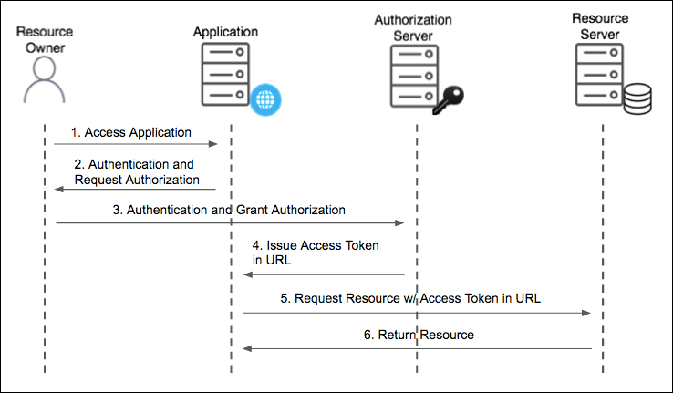
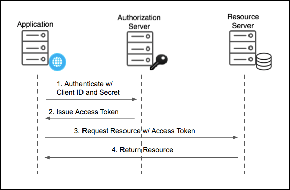

# 10. Spring Security OAuth2

</br>

## OAuth 2.0

> 사용자가 가입한 서비스(구글, 페이스북, 카카오, 네이버 등)에서 제공하는 API를 이용하여 데이터에 접근하기 위해서 사용자로부터 권한을 위임받아야한다.  
> `사용자의 패스워드 없이 권한을 위임 받을 수 있는 방법`이 필요, OAuth2.0라는 표준 인증 프로토콜을 통해 처리.

</br>

- 왜 API는 비밀번호만으로 인증하는 방법을 사용하지 않나?
  - 신뢰 : 사용자는 애플리케이션에 비밀전호 제공하기 꺼려
  - 불필요하게 넓은 접근 범위 : 비밀번호 제공함으로써 애플리케이션에 필요한 데이터 뿐만 아니라 사용자가 계정 안에 있는 모든 데이터 접근 가능
  - 사용성 : 사용자가 비밀번호 바꾸면 애플리케이션은 더는 해당 데이터에 접근 X

</br>

- OAuth
  - Resource Owner : 서비스를 이용하는 사용자이자, 리소스 사용자
  - Client (어플리케이션) : 리소스 소유자를 대신하여 보호된 리소스에 액세스하는 응용 프로그램
  - Resource server : 보호받는 리소스를 호스팅 하고 액세스 토큰을 사용하는 클라이언트의 요청을 수락하고 응답하는 서버
    - 카카오, 네이버 등의 리소스 서버
  - Authorization Server : 클라이언트 및 리소스 소유자를 성공적으로 인증한 후 액세스 토큰을 발급하는 서버
    - 카카오, 네이버 등의 인증 서버

</br>

### Authorization Code Grant

- OAuth 2.0에서 가장 중요하고, 널리 사용되는 인증 방법 - 이 방법에서 클라이언트는 써드파티 서비스의 백엔드 서버가 됨
  - 백엔드 서버가 존재하는 웹/모바일 서비스에 적합함
- 사용자 인증 후 Callback을 통해 authorization code를 받고, 이를 client-id, client-secret과 함께 Access-Tokend으로 교환함
- Callback 처리는 백엔드 서버에서 이뤄지기 때문에, Access-Token이 외부에 노출되지 않음(보안상 안전)

#### `4단계 처리 flow`

- Authorization Request - `클라이언트는 사용자를 Authorization Server로 리다이렉션`
  - response_type: code 고정
  - client_id: Authorization Server에서 클라이언트를 식별하기 위한 식별키
  - redirect_url: Authorization Server에서 처리 완료 후 리다이렉션하기 위한 URL
  - scope: 클라이언트가 요구하는 리소스를 정의
  - state: 클라이언트는 임의의 문자열을 생성하여 CSRF 공격을 방지함

```text
https://kauth.kakao.com/oauth/authorize
?response_type=code
&client_id=0492f15cb715d60526a3eb9e2323c559
&scope=profile_nickname%20profile_image
&state=xI8tRNCSoeiAIw87NaUr5foPbhBhW2METzHDBK75jgo%3D
&redirect_uri=http://localhost:8080/login/oauth2/code/kakao
```

- Authorization Response — `클라이언트에서 요구하는 리소스(scope)`에 대해 사용자 동의를 받고, 요청과 함께 전달된 `redirect_uri로 리다이렉션`
  - code — Access-Token 교환을 위한 승인 코드
  - state — 요청과 함께 전달 된 임의의 문자열

```text
  /login/oauth2/code/kakao
  ?code=jzcahTyqbAx4zs9pKfBDlGXmB36sPX2YJCNIIw0RKkW_ODsYTQpheSGABo17dHC5rXRD2Qopb9QAAAF76FELEg
  &state=xI8tRNCSoeiAIw87NaUr5foPbhBhW2METzHDBK75jgo%3D
```

- Token Request — 승인 코드를 Access-Token으로 교환
  - grant_type — authorization_code 고정
  - code — 앞 단계에서 전달 받은 코드
  - client_id — Authorization Server에서 클라이언트를 식별하기 위한 식별키
  - client_secret — 클라이언트 비밀키

```text
  HTTP POST https://kauth.kakao.com/oauth/token
  Accept=[application/json, application/*+json]
  Writing [
    {grant_type=[authorization_code],
    code=[jzcahTyqbAx4zs9pKfBDlGXmB36sPX2YJCNIIw0RKkW_ODsYTQpheSGABo17dHC5rXRD2Qopb9QAAAF76FELEg],
    redirect_uri=[http://localhost:8080/login/oauth2/code/kakao],
    client_id=[0492f15cb715d60526a3eb9e2323c559],
    client_secret=[oqoKOBecGMC45Uh7z7bmdtMJ0A4PSQ2l]}
  ] as "application/x-www-form-urlencoded;charset=UTF-8"
```

- Token Response — Access-Token 및 부가정보 획득
  - access_token — 리소스 요청에 필요한 토큰 (보통 짧은 생명주기를 지니고 있음)
  - refresh_token — Access-Token을 갱신하기 위한 토큰

|  Authorization Code Grant Type Flow  |
| :----------------------------------: |
|  |

- 1. 사용자가 브라우저를 통해 백엔드에 접근
- 2. 사용자의 브라우저를 Authorization Server의 uri로 리다이렉션
- 3. 인증 완료 후에 리소스에 대한 접근을 허용하는 `Authorization request` 단계
- 4. 액세스 토큰 교환을 위한 일회성 승인 코드가 백엔드 서버로 전달되는 `Authorization response` 단계
- 5. 일회성 승인 코드를 이용해서 액세스 토큰을 요청하는 `token request` 단계
- 6. 토큰 리퀘스트에대해서 액세스 토큰을 응답하는 `token response` 단계

</br>

### Implicit Grant

- `Authorization Code Grant 방식과 비교`했을 때, Authorization Response 단계에서 Access-Token이 전달되고 `Token Request 단계가 생략됨`
- `Access-Token이 redirect uri에 query string 방식으로 전달되어 노출`
  - 보안 리스크가 발생한다.
- 백엔드 서버가 없는 제한적인 환경에서만 사용을 권장함
  - 브라우저에서 자바스크립트와 같은 스크립트 언어로 동작하는 클라이언트

|         Implicit Grant Type Flow         |
| :--------------------------------------: |
|  |

</>

</br>

> code grant에서는 일회성 코드가 노출되지만 곧바로 사라지기 때문에 uri에 노출되어도 크게 리스크가 없는 값이다.  
> 하지만 access-token은 만료될 때까지 계속해서 사용할 수 있기때문에 보안 문제가 발상핸다.

</br>

### Client Credentials Grant

- client_id, client_secret 파리미터만 가지고 Access-Token을 발급할 수 있으며, `사용자는 전혀 관여하지 않음`
- 사용자의 직접적인 상호 작용 없이 백그라운드에서 실행해야 하는 서버 간 상호 작용에 사용

</br>

|              Client Credentials Grant              |
| :------------------------------------------------: |
|  |

</br>

### Resource Owner Password Credentials Grant

</br>

- Client Credentials Grant 방식과 매유 유사하지만, client_id, client_secret 대신 사용자 비밀번호로 인증됨
- 즉, 일반 로그인 아이디/비밀번호 인증
- `클라이언트를 완전히 신뢰할 수 있을 때 사용`
  - 즉, 서드파티 어플리케이션 말고, 공식 서비스일때 가능

|                Resource Owner Password Credentials Grant                |
| :---------------------------------------------------------------------: |
|  |

</br>

## Spring Security OAuth 2.0 Client (카카오 인증 연동)

</br>

- Spring security 인프라 스트럭처 위에서 Authorization Code Grant 타입 OAuth2.0 인증 처리 방법을 알아보자.

</br>

- [Kakao Developers](https://developers.kakao.com/)

|                 kakao developers                 |
| :----------------------------------------------: |
|  |

- 내 애플리케이션 클릭 후 앱이름과 사업자 명 넣은 후 저장

|            내 애플리케이션 클릭            |
| :----------------------------------------: |
|  |

</br>

- 카카오 로그인 메뉴 항목에서 활성화 설정 상태 ON

|                  로그인 활성화                   |
| :----------------------------------------------: |
|  |

</br>

- Redirect URI 등록

</br>

|               redirect uri 등록               |
| :-------------------------------------------: |
|  |

</br>

- 동의 항목에서 닉네임이랑 프로필 사진 `필수 동의로 설정`

</br>

|필수 동의 설정|
||

</br>

- 보안 항목에서 Client Secret 코드 생성
- 이후 활성화 상태도 `사용함`으로 변경

|   Client Secret 코드 생성    |
| :--------------------------: |
|  |
