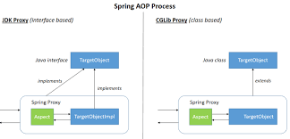
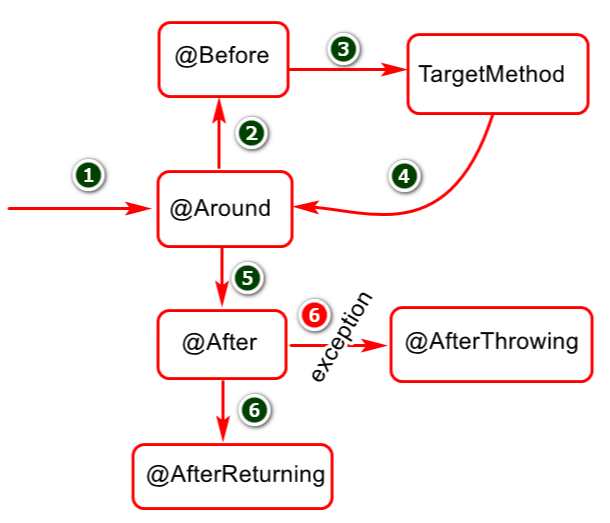

## **Table of Contents**

- [Table of Contents](#table-of-contents)

 

## **Day 1**

 

### **소프트웨어 테스팅**

 

> 소프트웨어의 결함을 찾는 행위

 

- testing level
  - unit
  - integration
  - component
  - end to end
  - exploratory

 

#### **Unit test**

 

> 프로그램의 기본 단위인 모듈을 테스트  
> 소프트웨어에서 테스트할 수 있는 가장 작은 단위  
> ex) 도메인, 서비스 각기 다르게 테스트가 가능.
>
> 크게 두가지 목적
>
> - 지속적으로 변경 될 때 발생하는 오류를 테스트 보호에 의해 보호
> - 구현 내용을 읽어 보지 않더라도 테스트 케이스만 보더라도 기능을 쉽게 파악 가능
>    

- SUT

> System under test  
> 테스트 대상 즉 클래스를 지칭  
> 의존 관계에 있는 다른 객체들을 협력 관계라가 지칭  
> 협력 관계에 있는 객체들을 테스트 더블로 대체해서  
> sut만 고립하여 진행하는게 단위 테스트

 

- Test Double
  - Stub
  - Mock

> sut의 협력 객체를 사용할 수 없을때 사용하는 것  
> 테스트 대상 코드와 상호작용하는 객체

 

#### **Integration Test**

 

> 개발자가 변경할 수 없는 부분까지 묶어서 검즈알 때 사용  
> DB에 접근하거나 전체 코드와 다양한 하ㅗㄴ경이 작동되는지 확인하는 모든 작업 수행  
> 단위테스트에서 발견하기 어려운 버그를 찾을 수 있다는 장점

 

#### **Junit**

 

> 매 단위 테스트시마다 테스트를 클래스의 인스턴스가 생성되어 독립적인 테스트가 가능  
> 애노테이션을 사용해서 라이프 사이클 관리 테스트 코드 간결하게 작성하도록 지원  
> 테스트 러너를 제공해서 인텔리제이/이클립스/메이븐에서도 쉽게 코트 실행  
> assert로 테스트 수행 결과를 판별 -> assertEquals

 

- Junit5

 

> `Junit Platform` : JVM상에 테스트 프레임워크를 런칭하기 위한 근간 제공, 테스트를 발견하고 테스트 계획을 생성하는 TestEngine 인터페이스를 가지고 있고, TestEngine을 통해서 테스트를 발견하고 실행하고 결과 보고  
> `Junit Jupiter` : Test Enigne의 실제 구현체, Jupiter api로 테스트 코드 작성 가능  
> `Junit Vintage` : Junit 4 버전으로 작성된 코드가 실행 될 때 사용

 

#### **Mock Object**

 

- Mock 오브젝트는 행위 검증을 사용하고,
- stub을 포함한 다른 대역들은 상태 검증을 사용

> 가짜객체가 stub이고
> Mock 객체는 호출에 대한 기대를 명세

- 상태 검증 : 메소드가 수행 된 후, 객체의 상태를 확인하여 올바르게 동작했는지 확인하는 검증법
- 행위 검증 : 메소드의 리턴 값으로 판단할 수 없는 경우 특정 동작을 수행하는지 확인하는 검증법

 

- Mock Object 생성을 도와주는 Test Framework
  - Mockito
  - JMock
  - EasyMock.

#### **Springdml JUnit 5 지원**

 

- 단위 테스트 지원

  - Mock Objects
  - General Testing Utiliteis
  - Spring MVC Testing Utilities

- 통합 테스트 지원

 

ApplicationContext가 실제로 만들어진걸 볼 수 있음
@ExtendWith(SpringExtension.class) 사용하면
실제 테스트 컨텍스트 프레임워크를 사용할 수 있게 된다.

 
 
 

## **Day 2**

 

### **JDBC**

 

- JDBC Driver
  - type 1 : JDBC - ODBC Bridge
  - type 2 : Nativce APT - Partly Java Driver
  - type 3 : Network Protocol-Fully Java Driver
  - type 4 : Thin Driver - Fully Java Driver -> `MySQL Connector`

 

- JDBC Flow
  - DriveManger를 통해서 커넥션 객체 받아오기
  - Connection을 통해 Statement 가져오기
  - Statement를 통해 쿼리를 실행하여 ResultSet을 가져오거나 update 실행
  - 데이터베이스 커넥션 종료

 

### **Spring JDBC**

 

> 커넥션 풀에 등록 한 후  
> 풀에서 커넥션을 가져온 후 커넥션을 사용하여  
> 커넥션을 풀에 반환하는 방식

 

#### HiKariCP

톰캣 2.0이상부터 hikari를 사용하고 있음

 

#### JDBC Template

 

Connection을 맺는 부분과 예외처리를 하는부분이 계속 반복되는 것을 볼 수 있음
객체와 데이터베이스를 매핑하는 부분도 중복되는 것을 발견할 수 있음.
Template call back 패턴을 이용한 JDBC Template을 이용하여 해결할 수 있다.

 

### **Day 3**

**Embedded Databse**

여태까지 DB를 띄우고 테스트를 진행함으로 DB를 연동이 Test에 직접적인 영향을 미치는 문제

namedparameterJdbcTemplate은

? 퀘스천마크를 이용하는 플레이스 홀더, 즉 인덱스 기반에서 이름 기반의 파라미터로 설정하게 해주는 템플릿

**트랜잭션 처리**

 

필요한 데이터베이스 연산을 모아놓은 것이고,
논리적인 작업의 단위가 된다.

### **Day 4**

### **Day 5**

 

#### **AOP**

 

> 횡단 관심사의 분리를 허용하여 모듈성을 증가시키는 것이 목적  
> 코드 핵심부, 비즈니스 로적과 얽히지 않는 동작을 추가할 수 있음.  
> Logging, Transaciton Management, Security

 

- 적용 방법
  - 컴파일 시점 (AspectJ)
  - 클래스 로딩 시점
  - 런타임 시점 (Proxy를 이용하여 Spring이 지원하는 방식)

 

|              Spring AOP Process              |
| :------------------------------------------: |
|  |

 

#### @AspectJ support

|               AOP execution               |
| :---------------------------------------: |
|  |

-타켓 : 핵심기능을 담고 있는 모듈로서 부가기능을 부여할 대상

-조인 포인트
어드바이스가 적용될 수 있는 위치
타겟 객체가 구현한 인터페이스의 모든 메서드

포인트 컷
어드바이스를 적용할 타겟의 메서드를 선별하는 정규표현식
포인트컷 표현식은 execution으로 시작하고 메서드의 signature를 비교하는 방법을 주로 이용

에스팩트
어드바이스 + 포인트컷
Springdptjsms Aspect 빈으로 등록해서 사용

어드바이스
어드바이스는 타겟의 특정 조인트 포인트에게 제공할 부가 기능
어드바이스에는 @Befor @After @Around @AfterReturning @AfterThrowing

위빙
타겟의 조인 포인트에 어드바이즈를 적용하는 과정

 

@Transactional
